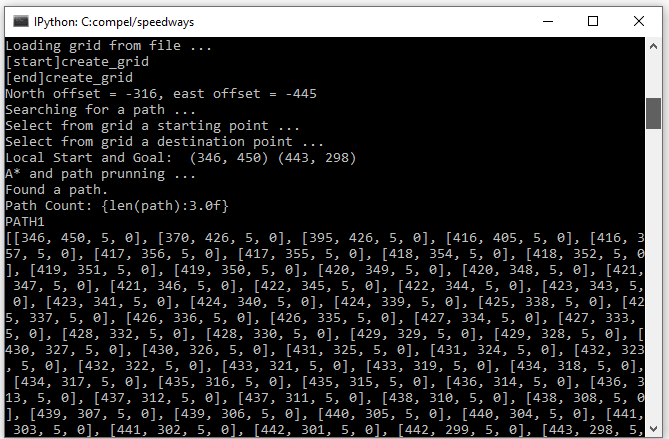
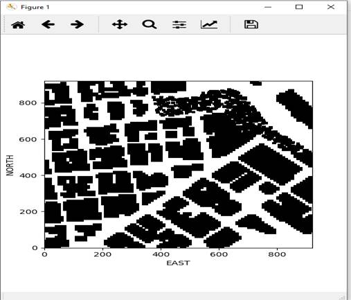
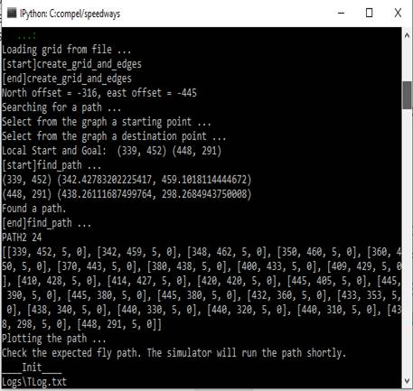
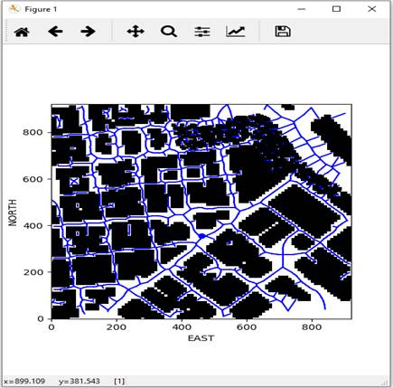
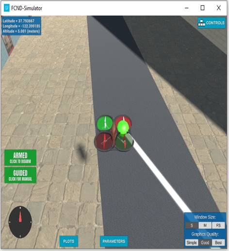

<html>

<head>
<meta http-equiv=Content-Type content="text/html; charset=windows-1252">
<link rel=File-List href="README_files/filelist.xml">
<link rel=Edit-Time-Data href="README_files/editdata.mso">
<!--[if !mso]>
<style>
v\:* {behavior:url(#default#VML);}
o\:* {behavior:url(#default#VML);}
w\:* {behavior:url(#default#VML);}
.shape {behavior:url(#default#VML);}
</style>
<![endif]--><!--[if gte mso 9]><xml>
 <o:DocumentProperties>
  <o:Author>compel UK</o:Author>
  <o:Template>Normal</o:Template>
  <o:LastAuthor>compel UK</o:LastAuthor>
  <o:Revision>2</o:Revision>
  <o:TotalTime>312</o:TotalTime>
  <o:Created>2021-05-17T20:57:00Z</o:Created>
  <o:LastSaved>2021-05-17T20:57:00Z</o:LastSaved>
  <o:Pages>1</o:Pages>
  <o:Words>1061</o:Words>
  <o:Characters>6050</o:Characters>
  <o:Lines>50</o:Lines>
  <o:Paragraphs>14</o:Paragraphs>
  <o:CharactersWithSpaces>7097</o:CharactersWithSpaces>
  <o:Version>16.00</o:Version>
 </o:DocumentProperties>
 <o:OfficeDocumentSettings>
  <o:AllowPNG/>
 </o:OfficeDocumentSettings>
</xml><![endif]-->
<link rel=themeData href="README_files/themedata.thmx">
<link rel=colorSchemeMapping href="README_files/colorschememapping.xml">
<!--[if gte mso 9]><xml>
 <w:WordDocument>
  <w:Zoom>170</w:Zoom>
  <w:SpellingState>Clean</w:SpellingState>
  <w:GrammarState>Clean</w:GrammarState>
  <w:TrackMoves>false</w:TrackMoves>
  <w:TrackFormatting/>
  <w:PunctuationKerning/>
  <w:ValidateAgainstSchemas/>
  <w:SaveIfXMLInvalid>false</w:SaveIfXMLInvalid>
  <w:IgnoreMixedContent>false</w:IgnoreMixedContent>
  <w:AlwaysShowPlaceholderText>false</w:AlwaysShowPlaceholderText>
  <w:DoNotPromoteQF/>
  <w:LidThemeOther>EN-GB</w:LidThemeOther>
  <w:LidThemeAsian>X-NONE</w:LidThemeAsian>
  <w:LidThemeComplexScript>AR-SA</w:LidThemeComplexScript>
  <w:Compatibility>
   <w:BreakWrappedTables/>
   <w:SnapToGridInCell/>
   <w:WrapTextWithPunct/>
   <w:UseAsianBreakRules/>
   <w:DontGrowAutofit/>
   <w:SplitPgBreakAndParaMark/>
   <w:EnableOpenTypeKerning/>
   <w:DontFlipMirrorIndents/>
   <w:OverrideTableStyleHps/>
  </w:Compatibility>
  <w:BrowserLevel>MicrosoftInternetExplorer4</w:BrowserLevel>
  <m:mathPr>
   <m:mathFont m:val="Cambria Math"/>
   <m:brkBin m:val="before"/>
   <m:brkBinSub m:val="&#45;-"/>
   <m:smallFrac m:val="off"/>
   <m:dispDef/>
   <m:lMargin m:val="0"/>
   <m:rMargin m:val="0"/>
   <m:defJc m:val="centerGroup"/>
   <m:wrapIndent m:val="1440"/>
   <m:intLim m:val="subSup"/>
   <m:naryLim m:val="undOvr"/>
  </m:mathPr></w:WordDocument>
</xml><![endif]--><!--[if gte mso 9]><xml>
 <w:LatentStyles DefLockedState="false" DefUnhideWhenUsed="false"
  DefSemiHidden="false" DefQFormat="false" LatentStyleCount="376">
  <w:LsdException Locked="false" QFormat="true" Name="Normal"/>
  <w:LsdException Locked="false" QFormat="true" Name="heading 1"/>
  <w:LsdException Locked="false" SemiHidden="true" UnhideWhenUsed="true"
   QFormat="true" Name="heading 2"/>
  <w:LsdException Locked="false" SemiHidden="true" UnhideWhenUsed="true"
   QFormat="true" Name="heading 3"/>
  <w:LsdException Locked="false" SemiHidden="true" UnhideWhenUsed="true"
   QFormat="true" Name="heading 4"/>
  <w:LsdException Locked="false" SemiHidden="true" UnhideWhenUsed="true"
   QFormat="true" Name="heading 5"/>
  <w:LsdException Locked="false" SemiHidden="true" UnhideWhenUsed="true"
   QFormat="true" Name="heading 6"/>
  <w:LsdException Locked="false" SemiHidden="true" UnhideWhenUsed="true"
   QFormat="true" Name="heading 7"/>
  <w:LsdException Locked="false" SemiHidden="true" UnhideWhenUsed="true"
   QFormat="true" Name="heading 8"/>
  <w:LsdException Locked="false" SemiHidden="true" UnhideWhenUsed="true"
   QFormat="true" Name="heading 9"/>
  <w:LsdException Locked="false" SemiHidden="true" UnhideWhenUsed="true"
   QFormat="true" Name="caption"/>
  <w:LsdException Locked="false" QFormat="true" Name="Title"/>
  <w:LsdException Locked="false" Priority="1" Name="Default Paragraph Font"/>
  <w:LsdException Locked="false" QFormat="true" Name="Subtitle"/>
  <w:LsdException Locked="false" QFormat="true" Name="Strong"/>
  <w:LsdException Locked="false" QFormat="true" Name="Emphasis"/>
  <w:LsdException Locked="false" SemiHidden="true" UnhideWhenUsed="true"
   Name="HTML Variable"/>
  <w:LsdException Locked="false" SemiHidden="true" UnhideWhenUsed="true"
   Name="Normal Table"/>
  <w:LsdException Locked="false" Priority="99" Name="No List"/>
  <w:LsdException Locked="false" SemiHidden="true" UnhideWhenUsed="true"
   Name="Outline List 3"/>
  <w:LsdException Locked="false" SemiHidden="true" UnhideWhenUsed="true"
   Name="Table Simple 1"/>
  <w:LsdException Locked="false" SemiHidden="true" UnhideWhenUsed="true"
   Name="Table Simple 2"/>
  <w:LsdException Locked="false" SemiHidden="true" UnhideWhenUsed="true"
   Name="Table Simple 3"/>
  <w:LsdException Locked="false" SemiHidden="true" UnhideWhenUsed="true"
   Name="Table Classic 1"/>
  <w:LsdException Locked="false" SemiHidden="true" UnhideWhenUsed="true"
   Name="Table Classic 2"/>
  <w:LsdException Locked="false" SemiHidden="true" UnhideWhenUsed="true"
   Name="Table Classic 3"/>
  <w:LsdException Locked="false" SemiHidden="true" UnhideWhenUsed="true"
   Name="Table Classic 4"/>
  <w:LsdException Locked="false" SemiHidden="true" UnhideWhenUsed="true"
   Name="Table Colorful 1"/>
  <w:LsdException Locked="false" SemiHidden="true" UnhideWhenUsed="true"
   Name="Table Colorful 2"/>
  <w:LsdException Locked="false" SemiHidden="true" UnhideWhenUsed="true"
   Name="Table Colorful 3"/>
  <w:LsdException Locked="false" SemiHidden="true" UnhideWhenUsed="true"
   Name="Table Columns 1"/>
  <w:LsdException Locked="false" SemiHidden="true" UnhideWhenUsed="true"
   Name="Table Columns 2"/>
  <w:LsdException Locked="false" SemiHidden="true" UnhideWhenUsed="true"
   Name="Table Columns 3"/>
  <w:LsdException Locked="false" SemiHidden="true" UnhideWhenUsed="true"
   Name="Table Columns 4"/>
  <w:LsdException Locked="false" SemiHidden="true" UnhideWhenUsed="true"
   Name="Table Columns 5"/>
  <w:LsdException Locked="false" SemiHidden="true" UnhideWhenUsed="true"
   Name="Table Grid 1"/>
  <w:LsdException Locked="false" SemiHidden="true" UnhideWhenUsed="true"
   Name="Table Grid 2"/>
  <w:LsdException Locked="false" SemiHidden="true" UnhideWhenUsed="true"
   Name="Table Grid 3"/>
  <w:LsdException Locked="false" SemiHidden="true" UnhideWhenUsed="true"
   Name="Table Grid 4"/>
  <w:LsdException Locked="false" SemiHidden="true" UnhideWhenUsed="true"
   Name="Table Grid 5"/>
  <w:LsdException Locked="false" SemiHidden="true" UnhideWhenUsed="true"
   Name="Table Grid 6"/>
  <w:LsdException Locked="false" SemiHidden="true" UnhideWhenUsed="true"
   Name="Table Grid 7"/>
  <w:LsdException Locked="false" SemiHidden="true" UnhideWhenUsed="true"
   Name="Table Grid 8"/>
  <w:LsdException Locked="false" SemiHidden="true" UnhideWhenUsed="true"
   Name="Table List 1"/>
  <w:LsdException Locked="false" SemiHidden="true" UnhideWhenUsed="true"
   Name="Table List 2"/>
  <w:LsdException Locked="false" SemiHidden="true" UnhideWhenUsed="true"
   Name="Table List 3"/>
  <w:LsdException Locked="false" SemiHidden="true" UnhideWhenUsed="true"
   Name="Table List 4"/>
  <w:LsdException Locked="false" SemiHidden="true" UnhideWhenUsed="true"
   Name="Table List 5"/>
  <w:LsdException Locked="false" SemiHidden="true" UnhideWhenUsed="true"
   Name="Table List 6"/>
  <w:LsdException Locked="false" SemiHidden="true" UnhideWhenUsed="true"
   Name="Table List 7"/>
  <w:LsdException Locked="false" SemiHidden="true" UnhideWhenUsed="true"
   Name="Table List 8"/>
  <w:LsdException Locked="false" SemiHidden="true" UnhideWhenUsed="true"
   Name="Table 3D effects 1"/>
  <w:LsdException Locked="false" SemiHidden="true" UnhideWhenUsed="true"
   Name="Table 3D effects 2"/>
  <w:LsdException Locked="false" SemiHidden="true" UnhideWhenUsed="true"
   Name="Table 3D effects 3"/>
  <w:LsdException Locked="false" SemiHidden="true" UnhideWhenUsed="true"
   Name="Table Contemporary"/>
  <w:LsdException Locked="false" SemiHidden="true" UnhideWhenUsed="true"
   Name="Table Elegant"/>
  <w:LsdException Locked="false" SemiHidden="true" UnhideWhenUsed="true"
   Name="Table Professional"/>
  <w:LsdException Locked="false" SemiHidden="true" UnhideWhenUsed="true"
   Name="Table Subtle 1"/>
  <w:LsdException Locked="false" SemiHidden="true" UnhideWhenUsed="true"
   Name="Table Subtle 2"/>
  <w:LsdException Locked="false" SemiHidden="true" UnhideWhenUsed="true"
   Name="Table Web 1"/>
  <w:LsdException Locked="false" SemiHidden="true" UnhideWhenUsed="true"
   Name="Table Web 2"/>
  <w:LsdException Locked="false" SemiHidden="true" UnhideWhenUsed="true"
   Name="Table Web 3"/>
  <w:LsdException Locked="false" SemiHidden="true" UnhideWhenUsed="true"
   Name="Balloon Text"/>
  <w:LsdException Locked="false" SemiHidden="true" UnhideWhenUsed="true"
   Name="Table Theme"/>
  <w:LsdException Locked="false" Priority="99" SemiHidden="true"
   Name="Placeholder Text"/>
  <w:LsdException Locked="false" Priority="1" QFormat="true" Name="No Spacing"/>
  <w:LsdException Locked="false" Priority="60" Name="Light Shading"/>
  <w:LsdException Locked="false" Priority="61" Name="Light List"/>
  <w:LsdException Locked="false" Priority="62" Name="Light Grid"/>
  <w:LsdException Locked="false" Priority="63" Name="Medium Shading 1"/>
  <w:LsdException Locked="false" Priority="64" Name="Medium Shading 2"/>
  <w:LsdException Locked="false" Priority="65" Name="Medium List 1"/>
  <w:LsdException Locked="false" Priority="66" Name="Medium List 2"/>
  <w:LsdException Locked="false" Priority="67" Name="Medium Grid 1"/>
  <w:LsdException Locked="false" Priority="68" Name="Medium Grid 2"/>
  <w:LsdException Locked="false" Priority="69" Name="Medium Grid 3"/>
  <w:LsdException Locked="false" Priority="70" Name="Dark List"/>
  <w:LsdException Locked="false" Priority="71" Name="Colorful Shading"/>
  <w:LsdException Locked="false" Priority="72" Name="Colorful List"/>
  <w:LsdException Locked="false" Priority="73" Name="Colorful Grid"/>
  <w:LsdException Locked="false" Priority="60" Name="Light Shading Accent 1"/>
  <w:LsdException Locked="false" Priority="61" Name="Light List Accent 1"/>
  <w:LsdException Locked="false" Priority="62" Name="Light Grid Accent 1"/>
  <w:LsdException Locked="false" Priority="63" Name="Medium Shading 1 Accent 1"/>
  <w:LsdException Locked="false" Priority="64" Name="Medium Shading 2 Accent 1"/>
  <w:LsdException Locked="false" Priority="65" Name="Medium List 1 Accent 1"/>
  <w:LsdException Locked="false" Priority="99" SemiHidden="true" Name="Revision"/>
  <w:LsdException Locked="false" Priority="34" QFormat="true"
   Name="List Paragraph"/>
  <w:LsdException Locked="false" Priority="29" QFormat="true" Name="Quote"/>
  <w:LsdException Locked="false" Priority="30" QFormat="true"
   Name="Intense Quote"/>
  <w:LsdException Locked="false" Priority="66" Name="Medium List 2 Accent 1"/>
  <w:LsdException Locked="false" Priority="67" Name="Medium Grid 1 Accent 1"/>
  <w:LsdException Locked="false" Priority="68" Name="Medium Grid 2 Accent 1"/>
  <w:LsdException Locked="false" Priority="69" Name="Medium Grid 3 Accent 1"/>
  <w:LsdException Locked="false" Priority="70" Name="Dark List Accent 1"/>
  <w:LsdException Locked="false" Priority="71" Name="Colorful Shading Accent 1"/>
  <w:LsdException Locked="false" Priority="72" Name="Colorful List Accent 1"/>
  <w:LsdException Locked="false" Priority="73" Name="Colorful Grid Accent 1"/>
  <w:LsdException Locked="false" Priority="60" Name="Light Shading Accent 2"/>
  <w:LsdException Locked="false" Priority="61" Name="Light List Accent 2"/>
  <w:LsdException Locked="false" Priority="62" Name="Light Grid Accent 2"/>
  <w:LsdException Locked="false" Priority="63" Name="Medium Shading 1 Accent 2"/>
  <w:LsdException Locked="false" Priority="64" Name="Medium Shading 2 Accent 2"/>
  <w:LsdException Locked="false" Priority="65" Name="Medium List 1 Accent 2"/>
  <w:LsdException Locked="false" Priority="66" Name="Medium List 2 Accent 2"/>
  <w:LsdException Locked="false" Priority="67" Name="Medium Grid 1 Accent 2"/>
  <w:LsdException Locked="false" Priority="68" Name="Medium Grid 2 Accent 2"/>
  <w:LsdException Locked="false" Priority="69" Name="Medium Grid 3 Accent 2"/>
  <w:LsdException Locked="false" Priority="70" Name="Dark List Accent 2"/>
  <w:LsdException Locked="false" Priority="71" Name="Colorful Shading Accent 2"/>
  <w:LsdException Locked="false" Priority="72" Name="Colorful List Accent 2"/>
  <w:LsdException Locked="false" Priority="73" Name="Colorful Grid Accent 2"/>
  <w:LsdException Locked="false" Priority="60" Name="Light Shading Accent 3"/>
  <w:LsdException Locked="false" Priority="61" Name="Light List Accent 3"/>
  <w:LsdException Locked="false" Priority="62" Name="Light Grid Accent 3"/>
  <w:LsdException Locked="false" Priority="63" Name="Medium Shading 1 Accent 3"/>
  <w:LsdException Locked="false" Priority="64" Name="Medium Shading 2 Accent 3"/>
  <w:LsdException Locked="false" Priority="65" Name="Medium List 1 Accent 3"/>
  <w:LsdException Locked="false" Priority="66" Name="Medium List 2 Accent 3"/>
  <w:LsdException Locked="false" Priority="67" Name="Medium Grid 1 Accent 3"/>
  <w:LsdException Locked="false" Priority="68" Name="Medium Grid 2 Accent 3"/>
  <w:LsdException Locked="false" Priority="69" Name="Medium Grid 3 Accent 3"/>
  <w:LsdException Locked="false" Priority="70" Name="Dark List Accent 3"/>
  <w:LsdException Locked="false" Priority="71" Name="Colorful Shading Accent 3"/>
  <w:LsdException Locked="false" Priority="72" Name="Colorful List Accent 3"/>
  <w:LsdException Locked="false" Priority="73" Name="Colorful Grid Accent 3"/>
  <w:LsdException Locked="false" Priority="60" Name="Light Shading Accent 4"/>
  <w:LsdException Locked="false" Priority="61" Name="Light List Accent 4"/>
  <w:LsdException Locked="false" Priority="62" Name="Light Grid Accent 4"/>
  <w:LsdException Locked="false" Priority="63" Name="Medium Shading 1 Accent 4"/>
  <w:LsdException Locked="false" Priority="64" Name="Medium Shading 2 Accent 4"/>
  <w:LsdException Locked="false" Priority="65" Name="Medium List 1 Accent 4"/>
  <w:LsdException Locked="false" Priority="66" Name="Medium List 2 Accent 4"/>
  <w:LsdException Locked="false" Priority="67" Name="Medium Grid 1 Accent 4"/>
  <w:LsdException Locked="false" Priority="68" Name="Medium Grid 2 Accent 4"/>
  <w:LsdException Locked="false" Priority="69" Name="Medium Grid 3 Accent 4"/>
  <w:LsdException Locked="false" Priority="70" Name="Dark List Accent 4"/>
  <w:LsdException Locked="false" Priority="71" Name="Colorful Shading Accent 4"/>
  <w:LsdException Locked="false" Priority="72" Name="Colorful List Accent 4"/>
  <w:LsdException Locked="false" Priority="73" Name="Colorful Grid Accent 4"/>
  <w:LsdException Locked="false" Priority="60" Name="Light Shading Accent 5"/>
  <w:LsdException Locked="false" Priority="61" Name="Light List Accent 5"/>
  <w:LsdException Locked="false" Priority="62" Name="Light Grid Accent 5"/>
  <w:LsdException Locked="false" Priority="63" Name="Medium Shading 1 Accent 5"/>
  <w:LsdException Locked="false" Priority="64" Name="Medium Shading 2 Accent 5"/>
  <w:LsdException Locked="false" Priority="65" Name="Medium List 1 Accent 5"/>
  <w:LsdException Locked="false" Priority="66" Name="Medium List 2 Accent 5"/>
  <w:LsdException Locked="false" Priority="67" Name="Medium Grid 1 Accent 5"/>
  <w:LsdException Locked="false" Priority="68" Name="Medium Grid 2 Accent 5"/>
  <w:LsdException Locked="false" Priority="69" Name="Medium Grid 3 Accent 5"/>
  <w:LsdException Locked="false" Priority="70" Name="Dark List Accent 5"/>
  <w:LsdException Locked="false" Priority="71" Name="Colorful Shading Accent 5"/>
  <w:LsdException Locked="false" Priority="72" Name="Colorful List Accent 5"/>
  <w:LsdException Locked="false" Priority="73" Name="Colorful Grid Accent 5"/>
  <w:LsdException Locked="false" Priority="60" Name="Light Shading Accent 6"/>
  <w:LsdException Locked="false" Priority="61" Name="Light List Accent 6"/>
  <w:LsdException Locked="false" Priority="62" Name="Light Grid Accent 6"/>
  <w:LsdException Locked="false" Priority="63" Name="Medium Shading 1 Accent 6"/>
  <w:LsdException Locked="false" Priority="64" Name="Medium Shading 2 Accent 6"/>
  <w:LsdException Locked="false" Priority="65" Name="Medium List 1 Accent 6"/>
  <w:LsdException Locked="false" Priority="66" Name="Medium List 2 Accent 6"/>
  <w:LsdException Locked="false" Priority="67" Name="Medium Grid 1 Accent 6"/>
  <w:LsdException Locked="false" Priority="68" Name="Medium Grid 2 Accent 6"/>
  <w:LsdException Locked="false" Priority="69" Name="Medium Grid 3 Accent 6"/>
  <w:LsdException Locked="false" Priority="70" Name="Dark List Accent 6"/>
  <w:LsdException Locked="false" Priority="71" Name="Colorful Shading Accent 6"/>
  <w:LsdException Locked="false" Priority="72" Name="Colorful List Accent 6"/>
  <w:LsdException Locked="false" Priority="73" Name="Colorful Grid Accent 6"/>
  <w:LsdException Locked="false" Priority="19" QFormat="true"
   Name="Subtle Emphasis"/>
  <w:LsdException Locked="false" Priority="21" QFormat="true"
   Name="Intense Emphasis"/>
  <w:LsdException Locked="false" Priority="31" QFormat="true"
   Name="Subtle Reference"/>
  <w:LsdException Locked="false" Priority="32" QFormat="true"
   Name="Intense Reference"/>
  <w:LsdException Locked="false" Priority="33" QFormat="true" Name="Book Title"/>
  <w:LsdException Locked="false" Priority="37" SemiHidden="true"
   UnhideWhenUsed="true" Name="Bibliography"/>
  <w:LsdException Locked="false" Priority="39" SemiHidden="true"
   UnhideWhenUsed="true" QFormat="true" Name="TOC Heading"/>
  <w:LsdException Locked="false" Priority="41" Name="Plain Table 1"/>
  <w:LsdException Locked="false" Priority="42" Name="Plain Table 2"/>
  <w:LsdException Locked="false" Priority="43" Name="Plain Table 3"/>
  <w:LsdException Locked="false" Priority="44" Name="Plain Table 4"/>
  <w:LsdException Locked="false" Priority="45" Name="Plain Table 5"/>
  <w:LsdException Locked="false" Priority="40" Name="Grid Table Light"/>
  <w:LsdException Locked="false" Priority="46" Name="Grid Table 1 Light"/>
  <w:LsdException Locked="false" Priority="47" Name="Grid Table 2"/>
  <w:LsdException Locked="false" Priority="48" Name="Grid Table 3"/>
  <w:LsdException Locked="false" Priority="49" Name="Grid Table 4"/>
  <w:LsdException Locked="false" Priority="50" Name="Grid Table 5 Dark"/>
  <w:LsdException Locked="false" Priority="51" Name="Grid Table 6 Colorful"/>
  <w:LsdException Locked="false" Priority="52" Name="Grid Table 7 Colorful"/>
  <w:LsdException Locked="false" Priority="46"
   Name="Grid Table 1 Light Accent 1"/>
  <w:LsdException Locked="false" Priority="47" Name="Grid Table 2 Accent 1"/>
  <w:LsdException Locked="false" Priority="48" Name="Grid Table 3 Accent 1"/>
  <w:LsdException Locked="false" Priority="49" Name="Grid Table 4 Accent 1"/>
  <w:LsdException Locked="false" Priority="50" Name="Grid Table 5 Dark Accent 1"/>
  <w:LsdException Locked="false" Priority="51"
   Name="Grid Table 6 Colorful Accent 1"/>
  <w:LsdException Locked="false" Priority="52"
   Name="Grid Table 7 Colorful Accent 1"/>
  <w:LsdException Locked="false" Priority="46"
   Name="Grid Table 1 Light Accent 2"/>
  <w:LsdException Locked="false" Priority="47" Name="Grid Table 2 Accent 2"/>
  <w:LsdException Locked="false" Priority="48" Name="Grid Table 3 Accent 2"/>
  <w:LsdException Locked="false" Priority="49" Name="Grid Table 4 Accent 2"/>
  <w:LsdException Locked="false" Priority="50" Name="Grid Table 5 Dark Accent 2"/>
  <w:LsdException Locked="false" Priority="51"
   Name="Grid Table 6 Colorful Accent 2"/>
  <w:LsdException Locked="false" Priority="52"
   Name="Grid Table 7 Colorful Accent 2"/>
  <w:LsdException Locked="false" Priority="46"
   Name="Grid Table 1 Light Accent 3"/>
  <w:LsdException Locked="false" Priority="47" Name="Grid Table 2 Accent 3"/>
  <w:LsdException Locked="false" Priority="48" Name="Grid Table 3 Accent 3"/>
  <w:LsdException Locked="false" Priority="49" Name="Grid Table 4 Accent 3"/>
  <w:LsdException Locked="false" Priority="50" Name="Grid Table 5 Dark Accent 3"/>
  <w:LsdException Locked="false" Priority="51"
   Name="Grid Table 6 Colorful Accent 3"/>
  <w:LsdException Locked="false" Priority="52"
   Name="Grid Table 7 Colorful Accent 3"/>
  <w:LsdException Locked="false" Priority="46"
   Name="Grid Table 1 Light Accent 4"/>
  <w:LsdException Locked="false" Priority="47" Name="Grid Table 2 Accent 4"/>
  <w:LsdException Locked="false" Priority="48" Name="Grid Table 3 Accent 4"/>
  <w:LsdException Locked="false" Priority="49" Name="Grid Table 4 Accent 4"/>
  <w:LsdException Locked="false" Priority="50" Name="Grid Table 5 Dark Accent 4"/>
  <w:LsdException Locked="false" Priority="51"
   Name="Grid Table 6 Colorful Accent 4"/>
  <w:LsdException Locked="false" Priority="52"
   Name="Grid Table 7 Colorful Accent 4"/>
  <w:LsdException Locked="false" Priority="46"
   Name="Grid Table 1 Light Accent 5"/>
  <w:LsdException Locked="false" Priority="47" Name="Grid Table 2 Accent 5"/>
  <w:LsdException Locked="false" Priority="48" Name="Grid Table 3 Accent 5"/>
  <w:LsdException Locked="false" Priority="49" Name="Grid Table 4 Accent 5"/>
  <w:LsdException Locked="false" Priority="50" Name="Grid Table 5 Dark Accent 5"/>
  <w:LsdException Locked="false" Priority="51"
   Name="Grid Table 6 Colorful Accent 5"/>
  <w:LsdException Locked="false" Priority="52"
   Name="Grid Table 7 Colorful Accent 5"/>
  <w:LsdException Locked="false" Priority="46"
   Name="Grid Table 1 Light Accent 6"/>
  <w:LsdException Locked="false" Priority="47" Name="Grid Table 2 Accent 6"/>
  <w:LsdException Locked="false" Priority="48" Name="Grid Table 3 Accent 6"/>
  <w:LsdException Locked="false" Priority="49" Name="Grid Table 4 Accent 6"/>
  <w:LsdException Locked="false" Priority="50" Name="Grid Table 5 Dark Accent 6"/>
  <w:LsdException Locked="false" Priority="51"
   Name="Grid Table 6 Colorful Accent 6"/>
  <w:LsdException Locked="false" Priority="52"
   Name="Grid Table 7 Colorful Accent 6"/>
  <w:LsdException Locked="false" Priority="46" Name="List Table 1 Light"/>
  <w:LsdException Locked="false" Priority="47" Name="List Table 2"/>
  <w:LsdException Locked="false" Priority="48" Name="List Table 3"/>
  <w:LsdException Locked="false" Priority="49" Name="List Table 4"/>
  <w:LsdException Locked="false" Priority="50" Name="List Table 5 Dark"/>
  <w:LsdException Locked="false" Priority="51" Name="List Table 6 Colorful"/>
  <w:LsdException Locked="false" Priority="52" Name="List Table 7 Colorful"/>
  <w:LsdException Locked="false" Priority="46"
   Name="List Table 1 Light Accent 1"/>
  <w:LsdException Locked="false" Priority="47" Name="List Table 2 Accent 1"/>
  <w:LsdException Locked="false" Priority="48" Name="List Table 3 Accent 1"/>
  <w:LsdException Locked="false" Priority="49" Name="List Table 4 Accent 1"/>
  <w:LsdException Locked="false" Priority="50" Name="List Table 5 Dark Accent 1"/>
  <w:LsdException Locked="false" Priority="51"
   Name="List Table 6 Colorful Accent 1"/>
  <w:LsdException Locked="false" Priority="52"
   Name="List Table 7 Colorful Accent 1"/>
  <w:LsdException Locked="false" Priority="46"
   Name="List Table 1 Light Accent 2"/>
  <w:LsdException Locked="false" Priority="47" Name="List Table 2 Accent 2"/>
  <w:LsdException Locked="false" Priority="48" Name="List Table 3 Accent 2"/>
  <w:LsdException Locked="false" Priority="49" Name="List Table 4 Accent 2"/>
  <w:LsdException Locked="false" Priority="50" Name="List Table 5 Dark Accent 2"/>
  <w:LsdException Locked="false" Priority="51"
   Name="List Table 6 Colorful Accent 2"/>
  <w:LsdException Locked="false" Priority="52"
   Name="List Table 7 Colorful Accent 2"/>
  <w:LsdException Locked="false" Priority="46"
   Name="List Table 1 Light Accent 3"/>
  <w:LsdException Locked="false" Priority="47" Name="List Table 2 Accent 3"/>
  <w:LsdException Locked="false" Priority="48" Name="List Table 3 Accent 3"/>
  <w:LsdException Locked="false" Priority="49" Name="List Table 4 Accent 3"/>
  <w:LsdException Locked="false" Priority="50" Name="List Table 5 Dark Accent 3"/>
  <w:LsdException Locked="false" Priority="51"
   Name="List Table 6 Colorful Accent 3"/>
  <w:LsdException Locked="false" Priority="52"
   Name="List Table 7 Colorful Accent 3"/>
  <w:LsdException Locked="false" Priority="46"
   Name="List Table 1 Light Accent 4"/>
  <w:LsdException Locked="false" Priority="47" Name="List Table 2 Accent 4"/>
  <w:LsdException Locked="false" Priority="48" Name="List Table 3 Accent 4"/>
  <w:LsdException Locked="false" Priority="49" Name="List Table 4 Accent 4"/>
  <w:LsdException Locked="false" Priority="50" Name="List Table 5 Dark Accent 4"/>
  <w:LsdException Locked="false" Priority="51"
   Name="List Table 6 Colorful Accent 4"/>
  <w:LsdException Locked="false" Priority="52"
   Name="List Table 7 Colorful Accent 4"/>
  <w:LsdException Locked="false" Priority="46"
   Name="List Table 1 Light Accent 5"/>
  <w:LsdException Locked="false" Priority="47" Name="List Table 2 Accent 5"/>
  <w:LsdException Locked="false" Priority="48" Name="List Table 3 Accent 5"/>
  <w:LsdException Locked="false" Priority="49" Name="List Table 4 Accent 5"/>
  <w:LsdException Locked="false" Priority="50" Name="List Table 5 Dark Accent 5"/>
  <w:LsdException Locked="false" Priority="51"
   Name="List Table 6 Colorful Accent 5"/>
  <w:LsdException Locked="false" Priority="52"
   Name="List Table 7 Colorful Accent 5"/>
  <w:LsdException Locked="false" Priority="46"
   Name="List Table 1 Light Accent 6"/>
  <w:LsdException Locked="false" Priority="47" Name="List Table 2 Accent 6"/>
  <w:LsdException Locked="false" Priority="48" Name="List Table 3 Accent 6"/>
  <w:LsdException Locked="false" Priority="49" Name="List Table 4 Accent 6"/>
  <w:LsdException Locked="false" Priority="50" Name="List Table 5 Dark Accent 6"/>
  <w:LsdException Locked="false" Priority="51"
   Name="List Table 6 Colorful Accent 6"/>
  <w:LsdException Locked="false" Priority="52"
   Name="List Table 7 Colorful Accent 6"/>
  <w:LsdException Locked="false" Priority="99" SemiHidden="true"
   UnhideWhenUsed="true" Name="Mention"/>
  <w:LsdException Locked="false" Priority="99" SemiHidden="true"
   UnhideWhenUsed="true" Name="Smart Hyperlink"/>
  <w:LsdException Locked="false" Priority="99" SemiHidden="true"
   UnhideWhenUsed="true" Name="Hashtag"/>
  <w:LsdException Locked="false" Priority="99" SemiHidden="true"
   UnhideWhenUsed="true" Name="Unresolved Mention"/>
  <w:LsdException Locked="false" Priority="99" SemiHidden="true"
   UnhideWhenUsed="true" Name="Smart Link"/>
 </w:LatentStyles>
</xml><![endif]-->
<style>
<!--
 /* Font Definitions */
 @font-face
	{font-family:"Cambria Math";
	panose-1:2 4 5 3 5 4 6 3 2 4;
	mso-font-charset:0;
	mso-generic-font-family:roman;
	mso-font-pitch:variable;
	mso-font-signature:3 0 0 0 1 0;}
@font-face
	{font-family:"Calibri Light";
	panose-1:2 15 3 2 2 2 4 3 2 4;
	mso-font-charset:0;
	mso-generic-font-family:swiss;
	mso-font-pitch:variable;
	mso-font-signature:-469750017 -1073732485 9 0 511 0;}
 /* Style Definitions */
 p.MsoNormal, li.MsoNormal, div.MsoNormal
	{mso-style-unhide:no;
	mso-style-qformat:yes;
	mso-style-parent:"";
	margin:0cm;
	mso-pagination:widow-orphan;
	font-size:12.0pt;
	font-family:"Times New Roman",serif;
	mso-fareast-font-family:"Times New Roman";}
a:link, span.MsoHyperlink
	{mso-style-unhide:no;
	color:#0563C1;
	mso-themecolor:hyperlink;
	text-decoration:underline;
	text-underline:single;}
a:visited, span.MsoHyperlinkFollowed
	{mso-style-unhide:no;
	color:#954F72;
	mso-themecolor:followedhyperlink;
	text-decoration:underline;
	text-underline:single;}
p.msonormal0, li.msonormal0, div.msonormal0
	{mso-style-name:msonormal;
	mso-style-unhide:no;
	mso-margin-top-alt:auto;
	margin-right:0cm;
	mso-margin-bottom-alt:auto;
	margin-left:0cm;
	mso-pagination:widow-orphan;
	font-size:12.0pt;
	font-family:"Times New Roman",serif;
	mso-fareast-font-family:"Times New Roman";
	mso-fareast-theme-font:minor-fareast;}
span.SpellE
	{mso-style-name:"";
	mso-spl-e:yes;}
span.GramE
	{mso-style-name:"";
	mso-gram-e:yes;}
.MsoChpDefault
	{mso-style-type:export-only;
	mso-default-props:yes;
	font-size:10.0pt;
	mso-ansi-font-size:10.0pt;
	mso-bidi-font-size:10.0pt;}
@page WordSection1
	{size:595.3pt 841.9pt;
	margin:72.0pt 90.0pt 72.0pt 90.0pt;
	mso-header-margin:35.4pt;
	mso-footer-margin:35.4pt;
	mso-paper-source:0;}
div.WordSection1
	{page:WordSection1;}
-->
</style>
<!--[if gte mso 10]>
<style>
 /* Style Definitions */
 table.MsoNormalTable
	{mso-style-name:"Table Normal";
	mso-tstyle-rowband-size:0;
	mso-tstyle-colband-size:0;
	mso-style-noshow:yes;
	mso-style-priority:99;
	mso-style-parent:"";
	mso-padding-alt:0cm 5.4pt 0cm 5.4pt;
	mso-para-margin:0cm;
	mso-pagination:widow-orphan;
	font-size:10.0pt;
	font-family:"Times New Roman",serif;}
</style>
<![endif]--><!--[if gte mso 9]><xml>
 <o:shapedefaults v:ext="edit" spidmax="1029"/>
</xml><![endif]--><!--[if gte mso 9]><xml>
 <o:shapelayout v:ext="edit">
  <o:idmap v:ext="edit" data="1"/>
 </o:shapelayout></xml><![endif]-->
</head>

<body lang=EN-GB link="#0563C1" vlink="#954F72" style='tab-interval:36.0pt;
word-wrap:break-word'>

<div class=WordSection1>

<p class=MsoNormal align=center style='text-align:center'><b><span
style='font-size:17.0pt;mso-ascii-font-family:"Times New Roman";mso-ascii-theme-font:
minor-bidi;mso-hansi-font-family:"Times New Roman";mso-hansi-theme-font:minor-bidi;
mso-bidi-font-family:"Times New Roman";mso-bidi-theme-font:minor-bidi'>Project:
3D Motion Planning<o:p></o:p></span></b></p>

<p class=MsoNormal><span style='mso-ascii-font-family:"Times New Roman";
mso-ascii-theme-font:minor-bidi;mso-hansi-font-family:"Times New Roman";
mso-hansi-theme-font:minor-bidi;mso-bidi-font-family:"Times New Roman";
mso-bidi-theme-font:minor-bidi'><o:p>&nbsp;</o:p></span></p>

<p class=MsoNormal><!--[if gte vml 1]><o:wrapblock><v:shapetype id="_x0000_t75"
  coordsize="21600,21600" o:spt="75" o:preferrelative="t" path="m@4@5l@4@11@9@11@9@5xe"
  filled="f" stroked="f">
  <v:stroke joinstyle="miter"/>
  <v:formulas>
   <v:f eqn="if lineDrawn pixelLineWidth 0"/>
   <v:f eqn="sum @0 1 0"/>
   <v:f eqn="sum 0 0 @1"/>
   <v:f eqn="prod @2 1 2"/>
   <v:f eqn="prod @3 21600 pixelWidth"/>
   <v:f eqn="prod @3 21600 pixelHeight"/>
   <v:f eqn="sum @0 0 1"/>
   <v:f eqn="prod @6 1 2"/>
   <v:f eqn="prod @7 21600 pixelWidth"/>
   <v:f eqn="sum @8 21600 0"/>
   <v:f eqn="prod @7 21600 pixelHeight"/>
   <v:f eqn="sum @10 21600 0"/>
  </v:formulas>
  <v:path o:extrusionok="f" gradientshapeok="t" o:connecttype="rect"/>
  <o:lock v:ext="edit" aspectratio="t"/>
 </v:shapetype><v:shape id="Picture_x0020_1" o:spid="_x0000_s1028" type="#_x0000_t75"
  style='position:absolute;margin-left:88.5pt;margin-top:11.2pt;width:876pt;
  height:657pt;z-index:-251658240;visibility:visible;mso-wrap-style:square;
  mso-width-percent:0;mso-height-percent:0;mso-wrap-distance-left:9pt;
  mso-wrap-distance-top:0;mso-wrap-distance-right:9pt;
  mso-wrap-distance-bottom:0;mso-position-horizontal:absolute;
  mso-position-horizontal-relative:text;mso-position-vertical:absolute;
  mso-position-vertical-relative:text;mso-width-percent:0;mso-height-percent:0;
  mso-width-relative:margin;mso-height-relative:margin'>
  <v:imagedata src="README_files/image001.png" o:title=""/>
  <w:wrap type="topAndBottom"/>
 </v:shape><![endif]--><![if !vml]><span style='mso-ignore:vglayout'>
 <table cellpadding=0 cellspacing=0 align=left>
  <tr>
   <td width=118 height=0></td>
  </tr>
  <tr>
   <td></td>
   <td></td>
  </tr>
 </table>
 </span><![endif]><!--[if gte vml 1]></o:wrapblock><![endif]--><br
style='mso-ignore:vglayout' clear=ALL>
<span style='mso-ascii-font-family:"Times New Roman";mso-ascii-theme-font:minor-bidi;
mso-hansi-font-family:"Times New Roman";mso-hansi-theme-font:minor-bidi;
mso-bidi-font-family:"Times New Roman";mso-bidi-theme-font:minor-bidi'><o:p></o:p></span></p>

<p class=MsoNormal><span style='mso-ascii-font-family:"Times New Roman";
mso-ascii-theme-font:minor-bidi;mso-hansi-font-family:"Times New Roman";
mso-hansi-theme-font:minor-bidi;mso-bidi-font-family:"Times New Roman";
mso-bidi-theme-font:minor-bidi'><o:p>&nbsp;</o:p></span></p>

<p class=MsoNormal><span style='mso-ascii-font-family:"Times New Roman";
mso-ascii-theme-font:minor-bidi;mso-hansi-font-family:"Times New Roman";
mso-hansi-theme-font:minor-bidi;mso-bidi-font-family:"Times New Roman";
mso-bidi-theme-font:minor-bidi'><o:p>&nbsp;</o:p></span></p>

<p class=MsoNormal><span style='mso-ascii-font-family:"Times New Roman";
mso-ascii-theme-font:minor-bidi;mso-hansi-font-family:"Times New Roman";
mso-hansi-theme-font:minor-bidi;mso-bidi-font-family:"Times New Roman";
mso-bidi-theme-font:minor-bidi'>---<o:p></o:p></span></p>

<p class=MsoNormal><b><span style='font-size:14.0pt;mso-ascii-font-family:"Times New Roman";
mso-ascii-theme-font:minor-bidi;mso-hansi-font-family:"Times New Roman";
mso-hansi-theme-font:minor-bidi;mso-bidi-font-family:"Times New Roman";
mso-bidi-theme-font:minor-bidi'>Overview<o:p></o:p></span></b></p>

<p class=MsoNormal><span style='mso-ascii-font-family:"Times New Roman";
mso-ascii-theme-font:minor-bidi;mso-hansi-font-family:"Times New Roman";
mso-hansi-theme-font:minor-bidi;mso-bidi-font-family:"Times New Roman";
mso-bidi-theme-font:minor-bidi'>Udacity Flying Car Nanodegree - Term 1 -
Project 2 - 3D Motion <span class=GramE>Planning</span><o:p></o:p></span></p>

<p class=MsoNormal><span style='mso-ascii-font-family:"Times New Roman";
mso-ascii-theme-font:minor-bidi;mso-hansi-font-family:"Times New Roman";
mso-hansi-theme-font:minor-bidi;mso-bidi-font-family:"Times New Roman";
mso-bidi-theme-font:minor-bidi'><o:p>&nbsp;</o:p></span></p>

<p class=MsoNormal><span style='mso-ascii-font-family:"Times New Roman";
mso-ascii-theme-font:minor-bidi;mso-hansi-font-family:"Times New Roman";
mso-hansi-theme-font:minor-bidi;mso-bidi-font-family:"Times New Roman";
mso-bidi-theme-font:minor-bidi'>This is the second project on Udacity's Flying
Car Nanodegree. This project <span class=GramE>demonstrate</span> how the drone
fly from the start to goal through the 2.5D map. Discretize the environment
into a grid &amp; graph representation. A* search algorithm is used to find the
shortest path. <o:p></o:p></span></p>

<p class=MsoNormal><span style='mso-ascii-font-family:"Times New Roman";
mso-ascii-theme-font:minor-bidi;mso-hansi-font-family:"Times New Roman";
mso-hansi-theme-font:minor-bidi;mso-bidi-font-family:"Times New Roman";
mso-bidi-theme-font:minor-bidi'><o:p>&nbsp;</o:p></span></p>

<p class=MsoNormal><b><span style='font-size:14.0pt;mso-ascii-font-family:"Times New Roman";
mso-ascii-theme-font:minor-bidi;mso-hansi-font-family:"Times New Roman";
mso-hansi-theme-font:minor-bidi;mso-bidi-font-family:"Times New Roman";
mso-bidi-theme-font:minor-bidi'>Setup<o:p></o:p></span></b></p>

<p class=MsoNormal><span style='mso-ascii-font-family:"Times New Roman";
mso-ascii-theme-font:minor-bidi;mso-hansi-font-family:"Times New Roman";
mso-hansi-theme-font:minor-bidi;mso-bidi-font-family:"Times New Roman";
mso-bidi-theme-font:minor-bidi'>* Download the [simulator](<a
href="https://github.com/udacity/FCND-Simulator-Releases/releases">https://github.com/udacity/FCND-Simulator-Releases/releases</a>).<o:p></o:p></span></p>

<p class=MsoNormal><span style='mso-ascii-font-family:"Times New Roman";
mso-ascii-theme-font:minor-bidi;mso-hansi-font-family:"Times New Roman";
mso-hansi-theme-font:minor-bidi;mso-bidi-font-family:"Times New Roman";
mso-bidi-theme-font:minor-bidi'>* Setup [Python <span class=GramE>environment](</span><a
href="https://github.com/udacity/FCND-Term1-Starter-Kit">https://github.com/udacity/FCND-Term1-Starter-Kit</a>)<o:p></o:p></span></p>

<p class=MsoNormal><span style='mso-ascii-font-family:"Times New Roman";
mso-ascii-theme-font:minor-bidi;mso-hansi-font-family:"Times New Roman";
mso-hansi-theme-font:minor-bidi;mso-bidi-font-family:"Times New Roman";
mso-bidi-theme-font:minor-bidi'>* Execute the fly by `python
motion_planning.py`<o:p></o:p></span></p>

<p class=MsoNormal><span style='mso-ascii-font-family:"Times New Roman";
mso-ascii-theme-font:minor-bidi;mso-hansi-font-family:"Times New Roman";
mso-hansi-theme-font:minor-bidi;mso-bidi-font-family:"Times New Roman";
mso-bidi-theme-font:minor-bidi'>* Refer to the [<span class=SpellE>UdaciDrone</span>
<span class=GramE>API](</span><a href="https://udacity.github.io/udacidrone/">https://udacity.github.io/udacidrone/</a>)
if needed<o:p></o:p></span></p>

<p class=MsoNormal><span style='mso-ascii-font-family:"Times New Roman";
mso-ascii-theme-font:minor-bidi;mso-hansi-font-family:"Times New Roman";
mso-hansi-theme-font:minor-bidi;mso-bidi-font-family:"Times New Roman";
mso-bidi-theme-font:minor-bidi'>* More detail information about simulator and
python environment setup can be found [here](<a
href="https://github.com/udacity/FCND-Motion-Planning/blob/master/README.md">https://github.com/udacity/FCND-Motion-Planning/blob/master/README.md</a>).<o:p></o:p></span></p>

<p class=MsoNormal><span style='mso-ascii-font-family:"Times New Roman";
mso-ascii-theme-font:minor-bidi;mso-hansi-font-family:"Times New Roman";
mso-hansi-theme-font:minor-bidi;mso-bidi-font-family:"Times New Roman";
mso-bidi-theme-font:minor-bidi'><o:p>&nbsp;</o:p></span></p>

<p class=MsoNormal><span style='mso-ascii-font-family:"Times New Roman";
mso-ascii-theme-font:minor-bidi;mso-hansi-font-family:"Times New Roman";
mso-hansi-theme-font:minor-bidi;mso-bidi-font-family:"Times New Roman";
mso-bidi-theme-font:minor-bidi'><o:p>&nbsp;</o:p></span></p>

<p class=MsoNormal><span style='mso-ascii-font-family:"Times New Roman";
mso-ascii-theme-font:minor-bidi;mso-hansi-font-family:"Times New Roman";
mso-hansi-theme-font:minor-bidi;mso-bidi-font-family:"Times New Roman";
mso-bidi-theme-font:minor-bidi'><o:p>&nbsp;</o:p></span></p>

<p class=MsoNormal><b><span style='font-size:14.0pt;mso-ascii-font-family:"Times New Roman";
mso-ascii-theme-font:minor-bidi;mso-hansi-font-family:"Times New Roman";
mso-hansi-theme-font:minor-bidi;mso-bidi-font-family:"Times New Roman";
mso-bidi-theme-font:minor-bidi'>Starter Code<o:p></o:p></span></b></p>

<p class=MsoNormal><span style='mso-ascii-font-family:"Times New Roman";
mso-ascii-theme-font:minor-bidi;mso-hansi-font-family:"Times New Roman";
mso-hansi-theme-font:minor-bidi;mso-bidi-font-family:"Times New Roman";
mso-bidi-theme-font:minor-bidi'><o:p>&nbsp;</o:p></span></p>

<p class=MsoNormal><span style='mso-ascii-font-family:"Times New Roman";
mso-ascii-theme-font:minor-bidi;mso-hansi-font-family:"Times New Roman";
mso-hansi-theme-font:minor-bidi;mso-bidi-font-family:"Times New Roman";
mso-bidi-theme-font:minor-bidi'>I started with following files:<o:p></o:p></span></p>

<p class=MsoNormal><span style='mso-ascii-font-family:"Times New Roman";
mso-ascii-theme-font:minor-bidi;mso-hansi-font-family:"Times New Roman";
mso-hansi-theme-font:minor-bidi;mso-bidi-font-family:"Times New Roman";
mso-bidi-theme-font:minor-bidi'><o:p>&nbsp;</o:p></span></p>

<p class=MsoNormal><span style='mso-ascii-font-family:"Times New Roman";
mso-ascii-theme-font:minor-bidi;mso-hansi-font-family:"Times New Roman";
mso-hansi-theme-font:minor-bidi;mso-bidi-font-family:"Times New Roman";
mso-bidi-theme-font:minor-bidi'>* `<a href="backyard_flyer_solution.py">backyard_flyer_solution.py</a>`<o:p></o:p></span></p>

<p class=MsoNormal><span style='mso-ascii-font-family:"Times New Roman";
mso-ascii-theme-font:minor-bidi;mso-hansi-font-family:"Times New Roman";
mso-hansi-theme-font:minor-bidi;mso-bidi-font-family:"Times New Roman";
mso-bidi-theme-font:minor-bidi'>* `<a href="motion_planning_search_grid.py">motion_planning_search_grid.py</a>`<o:p></o:p></span></p>

<p class=MsoNormal><span style='mso-ascii-font-family:"Times New Roman";
mso-ascii-theme-font:minor-bidi;mso-hansi-font-family:"Times New Roman";
mso-hansi-theme-font:minor-bidi;mso-bidi-font-family:"Times New Roman";
mso-bidi-theme-font:minor-bidi'>* `<a href="planning_utils_search_gaph.py">motion_planning_search_graph.py</a>`<o:p></o:p></span></p>

<p class=MsoNormal><span style='mso-ascii-font-family:"Times New Roman";
mso-ascii-theme-font:minor-bidi;mso-hansi-font-family:"Times New Roman";
mso-hansi-theme-font:minor-bidi;mso-bidi-font-family:"Times New Roman";
mso-bidi-theme-font:minor-bidi'><o:p>&nbsp;</o:p></span></p>

<p class=MsoNormal><span style='mso-ascii-font-family:"Times New Roman";
mso-ascii-theme-font:minor-bidi;mso-hansi-font-family:"Times New Roman";
mso-hansi-theme-font:minor-bidi;mso-bidi-font-family:"Times New Roman";
mso-bidi-theme-font:minor-bidi'>`motion_planning_search_grid.py` is a modified
version of `backyard_flyer_solution.py` that leverages some extra functions in
`<a href="planning_utils_search_grid.py">planning_utils_search_grid.py</a>`.
The scripts contain a planning implementation by using '<span class=SpellE>create_<span
class=GramE>grid</span></span><span class=GramE>(</span>)'.<o:p></o:p></span></p>

<p class=MsoNormal><span style='mso-ascii-font-family:"Times New Roman";
mso-ascii-theme-font:minor-bidi;mso-hansi-font-family:"Times New Roman";
mso-hansi-theme-font:minor-bidi;mso-bidi-font-family:"Times New Roman";
mso-bidi-theme-font:minor-bidi'><o:p>&nbsp;</o:p></span></p>

<p class=MsoNormal><span style='mso-ascii-font-family:"Times New Roman";
mso-ascii-theme-font:minor-bidi;mso-hansi-font-family:"Times New Roman";
mso-hansi-theme-font:minor-bidi;mso-bidi-font-family:"Times New Roman";
mso-bidi-theme-font:minor-bidi'>A grid for a particular altitude and safety
margin around obstacles is also build. To create the grid using ```<span
class=SpellE>create_<span class=GramE>grid</span></span><span class=GramE>(</span>)```
in ```<a href="planning_utils_search_grid.py">planning_utils_search_grid.py</a>```<o:p></o:p></span></p>

<p class=MsoNormal><span style='mso-ascii-font-family:"Times New Roman";
mso-ascii-theme-font:minor-bidi;mso-hansi-font-family:"Times New Roman";
mso-hansi-theme-font:minor-bidi;mso-bidi-font-family:"Times New Roman";
mso-bidi-theme-font:minor-bidi'>the planner performs path planning in the
method `<span class=SpellE>plan_<span class=GramE>path</span></span><span
class=GramE>(</span>)` with following steps: <o:p></o:p></span></p>

<p class=MsoNormal><span style='mso-ascii-font-family:"Times New Roman";
mso-ascii-theme-font:minor-bidi;mso-hansi-font-family:"Times New Roman";
mso-hansi-theme-font:minor-bidi;mso-bidi-font-family:"Times New Roman";
mso-bidi-theme-font:minor-bidi'><o:p>&nbsp;</o:p></span></p>

<p class=MsoNormal><span style='mso-ascii-font-family:"Times New Roman";
mso-ascii-theme-font:minor-bidi;mso-hansi-font-family:"Times New Roman";
mso-hansi-theme-font:minor-bidi;mso-bidi-font-family:"Times New Roman";
mso-bidi-theme-font:minor-bidi'>1. Reads in the file `colliders.csv` containing
obstacle data<o:p></o:p></span></p>

<p class=MsoNormal><span style='mso-ascii-font-family:"Times New Roman";
mso-ascii-theme-font:minor-bidi;mso-hansi-font-family:"Times New Roman";
mso-hansi-theme-font:minor-bidi;mso-bidi-font-family:"Times New Roman";
mso-bidi-theme-font:minor-bidi'>2. Extracts a grid representation of a 2D
configuration space with the method `<span class=SpellE>create_<span
class=GramE>grid</span></span><span class=GramE>(</span>)` in `<a
href="planning_utils_search_grid.py">planning_utils_search_grid.py</a>`<o:p></o:p></span></p>

<p class=MsoNormal><span style='mso-ascii-font-family:"Times New Roman";
mso-ascii-theme-font:minor-bidi;mso-hansi-font-family:"Times New Roman";
mso-hansi-theme-font:minor-bidi;mso-bidi-font-family:"Times New Roman";
mso-bidi-theme-font:minor-bidi'>3. Defines the start and goal points<o:p></o:p></span></p>

<p class=MsoNormal><span style='mso-ascii-font-family:"Times New Roman";
mso-ascii-theme-font:minor-bidi;mso-hansi-font-family:"Times New Roman";
mso-hansi-theme-font:minor-bidi;mso-bidi-font-family:"Times New Roman";
mso-bidi-theme-font:minor-bidi'>4. Performs A* search to find a path from start
to goal with the method `<span class=SpellE>a_<span class=GramE>star</span></span><span
class=GramE>(</span>)` in `<a href="planning_utils_search_grid.py">planning_utils_search_grid.py</a>`<o:p></o:p></span></p>

<p class=MsoNormal><span style='mso-ascii-font-family:"Times New Roman";
mso-ascii-theme-font:minor-bidi;mso-hansi-font-family:"Times New Roman";
mso-hansi-theme-font:minor-bidi;mso-bidi-font-family:"Times New Roman";
mso-bidi-theme-font:minor-bidi'>5. Converts the planned path into waypoints,
and send the waypoints to simulator<o:p></o:p></span></p>

<p class=MsoNormal><span style='mso-ascii-font-family:"Times New Roman";
mso-ascii-theme-font:minor-bidi;mso-hansi-font-family:"Times New Roman";
mso-hansi-theme-font:minor-bidi;mso-bidi-font-family:"Times New Roman";
mso-bidi-theme-font:minor-bidi'><o:p>&nbsp;</o:p></span></p>

<p class=MsoNormal><span class=GramE><span style='mso-ascii-font-family:"Times New Roman";
mso-ascii-theme-font:minor-bidi;mso-hansi-font-family:"Times New Roman";
mso-hansi-theme-font:minor-bidi;mso-bidi-font-family:"Times New Roman";
mso-bidi-theme-font:minor-bidi'>Here's</span></span><span style='mso-ascii-font-family:
"Times New Roman";mso-ascii-theme-font:minor-bidi;mso-hansi-font-family:"Times New Roman";
mso-hansi-theme-font:minor-bidi;mso-bidi-font-family:"Times New Roman";
mso-bidi-theme-font:minor-bidi'> the grid configuration space created from
`colliders.csv`, green <span class=SpellE>color</span> areas are the safety
distance from the actual obstacles:<o:p></o:p></span></p>

<p class=MsoNormal><span style='mso-ascii-font-family:"Times New Roman";
mso-ascii-theme-font:minor-bidi;mso-hansi-font-family:"Times New Roman";
mso-hansi-theme-font:minor-bidi;mso-bidi-font-family:"Times New Roman";
mso-bidi-theme-font:minor-bidi'><o:p>&nbsp;</o:p></span></p>

<p class=MsoNormal><span style='font-size:14.0pt;font-family:"Calibri Light",sans-serif;
mso-ascii-theme-font:major-latin;mso-hansi-theme-font:major-latin;mso-bidi-theme-font:
major-latin'>```<o:p></o:p></span></p>

<p class=MsoNormal><span style='font-size:14.0pt;font-family:"Calibri Light",sans-serif;
mso-ascii-theme-font:major-latin;mso-hansi-theme-font:major-latin;mso-bidi-theme-font:
major-latin'><span style='mso-spacerun:yes'> </span># read lat0, lon0 from
colliders into floating point values<o:p></o:p></span></p>

<p class=MsoNormal><span style='font-size:14.0pt;font-family:"Calibri Light",sans-serif;
mso-ascii-theme-font:major-latin;mso-hansi-theme-font:major-latin;mso-bidi-theme-font:
major-latin'><span style='mso-spacerun:yes'> </span>header = open(<span
class=SpellE>map_file_name</span><span class=GramE>).<span class=SpellE>readline</span></span>()<o:p></o:p></span></p>

<p class=MsoNormal><span style='font-size:14.0pt;font-family:"Calibri Light",sans-serif;
mso-ascii-theme-font:major-latin;mso-hansi-theme-font:major-latin;mso-bidi-theme-font:
major-latin'><span style='mso-spacerun:yes'> </span>s = <span class=SpellE><span
class=GramE>re.findall</span></span>(r&quot;[-+]?\d*\.\d+|\d+&quot;, header)<o:p></o:p></span></p>

<p class=MsoNormal><span style='font-size:14.0pt;font-family:"Calibri Light",sans-serif;
mso-ascii-theme-font:major-latin;mso-hansi-theme-font:major-latin;mso-bidi-theme-font:
major-latin'><span style='mso-spacerun:yes'> </span>self.lat_0 = float(<span
class=GramE>s[</span>1]) #global <span class=SpellE>hoome</span> position of
drone<o:p></o:p></span></p>

<p class=MsoNormal><span style='font-size:14.0pt;font-family:"Calibri Light",sans-serif;
mso-ascii-theme-font:major-latin;mso-hansi-theme-font:major-latin;mso-bidi-theme-font:
major-latin'><span style='mso-spacerun:yes'> </span>self.lon_0 = float(<span
class=GramE>s[</span>3])<o:p></o:p></span></p>

<p class=MsoNormal><span style='font-size:14.0pt;font-family:"Calibri Light",sans-serif;
mso-ascii-theme-font:major-latin;mso-hansi-theme-font:major-latin;mso-bidi-theme-font:
major-latin'><o:p>&nbsp;</o:p></span></p>

<p class=MsoNormal><span style='font-size:14.0pt;font-family:"Calibri Light",sans-serif;
mso-ascii-theme-font:major-latin;mso-hansi-theme-font:major-latin;mso-bidi-theme-font:
major-latin'><span style='mso-spacerun:yes'> </span># Read in obstacle map<o:p></o:p></span></p>

<p class=MsoNormal><span style='font-size:14.0pt;font-family:"Calibri Light",sans-serif;
mso-ascii-theme-font:major-latin;mso-hansi-theme-font:major-latin;mso-bidi-theme-font:
major-latin'><span style='mso-spacerun:yes'> </span>data = <span class=SpellE><span
class=GramE>np.loadtxt</span></span>(<span class=SpellE>map_file_name</span>,
delimiter=',', <span class=SpellE>dtype</span>='Float64', <span class=SpellE>skiprows</span>=2)<o:p></o:p></span></p>

<p class=MsoNormal><span style='font-size:14.0pt;font-family:"Calibri Light",sans-serif;
mso-ascii-theme-font:major-latin;mso-hansi-theme-font:major-latin;mso-bidi-theme-font:
major-latin'><span style='mso-spacerun:yes'>        </span><o:p></o:p></span></p>

<p class=MsoNormal><span style='font-size:14.0pt;font-family:"Calibri Light",sans-serif;
mso-ascii-theme-font:major-latin;mso-hansi-theme-font:major-latin;mso-bidi-theme-font:
major-latin'><span style='mso-spacerun:yes'> </span># Define a grid for a
particular altitude and safety margin around obstacles<o:p></o:p></span></p>

<p class=MsoNormal><span style='font-size:14.0pt;font-family:"Calibri Light",sans-serif;
mso-ascii-theme-font:major-latin;mso-hansi-theme-font:major-latin;mso-bidi-theme-font:
major-latin'><span style='mso-spacerun:yes'> </span><span class=SpellE><span
class=GramE>self.grid</span></span>, <span class=SpellE>self.north_offset</span>,
<span class=SpellE>self.east_offset</span> = <span class=SpellE>create_grid</span>(data,
<span class=SpellE>self.TARGET_ALTITUDE</span>, <span class=SpellE>self.SAFETY_DISTANCE</span>)<o:p></o:p></span></p>

<p class=MsoNormal><span style='mso-ascii-font-family:"Times New Roman";
mso-ascii-theme-font:minor-bidi;mso-hansi-font-family:"Times New Roman";
mso-hansi-theme-font:minor-bidi;mso-bidi-font-family:"Times New Roman";
mso-bidi-theme-font:minor-bidi'>```<o:p></o:p></span></p>

<p class=MsoNormal><span style='mso-ascii-font-family:"Times New Roman";
mso-ascii-theme-font:minor-bidi;mso-hansi-font-family:"Times New Roman";
mso-hansi-theme-font:minor-bidi;mso-bidi-font-family:"Times New Roman";
mso-bidi-theme-font:minor-bidi'><o:p>&nbsp;</o:p></span></p>

<p class=MsoNormal><b><span style='font-size:14.0pt;mso-ascii-font-family:"Times New Roman";
mso-ascii-theme-font:minor-bidi;mso-hansi-font-family:"Times New Roman";
mso-hansi-theme-font:minor-bidi;mso-bidi-font-family:"Times New Roman";
mso-bidi-theme-font:minor-bidi'>Global home position<o:p></o:p></span></b></p>

<p class=MsoNormal><span style='mso-ascii-font-family:"Times New Roman";
mso-ascii-theme-font:minor-bidi;mso-hansi-font-family:"Times New Roman";
mso-hansi-theme-font:minor-bidi;mso-bidi-font-family:"Times New Roman";
mso-bidi-theme-font:minor-bidi'><o:p>&nbsp;</o:p></span></p>

<p class=MsoNormal><span style='mso-ascii-font-family:"Times New Roman";
mso-ascii-theme-font:minor-bidi;mso-hansi-font-family:"Times New Roman";
mso-hansi-theme-font:minor-bidi;mso-bidi-font-family:"Times New Roman";
mso-bidi-theme-font:minor-bidi'>The home position is set while the drone
arming.<o:p></o:p></span></p>

<p class=MsoNormal><span style='mso-ascii-font-family:"Times New Roman";
mso-ascii-theme-font:minor-bidi;mso-hansi-font-family:"Times New Roman";
mso-hansi-theme-font:minor-bidi;mso-bidi-font-family:"Times New Roman";
mso-bidi-theme-font:minor-bidi'>To set the global home position using ```<span
class=SpellE>self.set_home_<span class=GramE>position</span></span><span
class=GramE>(</span>).```<o:p></o:p></span></p>

<p class=MsoNormal><span style='mso-ascii-font-family:"Times New Roman";
mso-ascii-theme-font:minor-bidi;mso-hansi-font-family:"Times New Roman";
mso-hansi-theme-font:minor-bidi;mso-bidi-font-family:"Times New Roman";
mso-bidi-theme-font:minor-bidi'><o:p>&nbsp;</o:p></span></p>

<p class=MsoNormal><span style='font-size:14.0pt;font-family:"Calibri Light",sans-serif;
mso-ascii-theme-font:major-latin;mso-hansi-theme-font:major-latin;mso-bidi-theme-font:
major-latin'>######<o:p></o:p></span></p>

<p class=MsoNormal><span style='font-size:14.0pt;font-family:"Calibri Light",sans-serif;
mso-ascii-theme-font:major-latin;mso-hansi-theme-font:major-latin;mso-bidi-theme-font:
major-latin'><span style='mso-spacerun:yes'>   </span>def <span class=SpellE>arming_transition</span>(self):<o:p></o:p></span></p>

<p class=MsoNormal><span style='font-size:14.0pt;font-family:"Calibri Light",sans-serif;
mso-ascii-theme-font:major-latin;mso-hansi-theme-font:major-latin;mso-bidi-theme-font:
major-latin'><span style='mso-spacerun:yes'>        </span><span class=SpellE><span
class=GramE>self.flight</span>_state</span> = <span class=SpellE>States.ARMING</span><o:p></o:p></span></p>

<p class=MsoNormal><span style='font-size:14.0pt;font-family:"Calibri Light",sans-serif;
mso-ascii-theme-font:major-latin;mso-hansi-theme-font:major-latin;mso-bidi-theme-font:
major-latin'><span style='mso-spacerun:yes'>        </span><span class=GramE>print(</span>&quot;&lt;arming
transition&gt;&quot;)<o:p></o:p></span></p>

<p class=MsoNormal><span style='font-size:14.0pt;font-family:"Calibri Light",sans-serif;
mso-ascii-theme-font:major-latin;mso-hansi-theme-font:major-latin;mso-bidi-theme-font:
major-latin'><span style='mso-spacerun:yes'>        </span><span class=SpellE><span
class=GramE>self.arm</span></span><span class=GramE>(</span>)<o:p></o:p></span></p>

<p class=MsoNormal><span style='font-size:14.0pt;font-family:"Calibri Light",sans-serif;
mso-ascii-theme-font:major-latin;mso-hansi-theme-font:major-latin;mso-bidi-theme-font:
major-latin'><span style='mso-spacerun:yes'>        </span><span class=SpellE><span
class=GramE>self.take</span>_control</span>()<o:p></o:p></span></p>

<p class=MsoNormal><span style='font-size:14.0pt;font-family:"Calibri Light",sans-serif;
mso-ascii-theme-font:major-latin;mso-hansi-theme-font:major-latin;mso-bidi-theme-font:
major-latin'><span style='mso-spacerun:yes'>        </span><span class=SpellE>self.set_home_<span
class=GramE>position</span></span><span class=GramE>(</span>self.lon_0,
self.lat_0, 0)<o:p></o:p></span></p>

<p class=MsoNormal><span style='mso-ascii-font-family:"Times New Roman";
mso-ascii-theme-font:minor-bidi;mso-hansi-font-family:"Times New Roman";
mso-hansi-theme-font:minor-bidi;mso-bidi-font-family:"Times New Roman";
mso-bidi-theme-font:minor-bidi'>######<o:p></o:p></span></p>

<p class=MsoNormal><span style='mso-ascii-font-family:"Times New Roman";
mso-ascii-theme-font:minor-bidi;mso-hansi-font-family:"Times New Roman";
mso-hansi-theme-font:minor-bidi;mso-bidi-font-family:"Times New Roman";
mso-bidi-theme-font:minor-bidi'><o:p>&nbsp;</o:p></span></p>

<p class=MsoNormal><b><span style='font-size:17.0pt;mso-ascii-font-family:"Times New Roman";
mso-ascii-theme-font:minor-bidi;mso-hansi-font-family:"Times New Roman";
mso-hansi-theme-font:minor-bidi;mso-bidi-font-family:"Times New Roman";
mso-bidi-theme-font:minor-bidi'>Load 2.5D map<o:p></o:p></span></b></p>

<p class=MsoNormal><span style='mso-ascii-font-family:"Times New Roman";
mso-ascii-theme-font:minor-bidi;mso-hansi-font-family:"Times New Roman";
mso-hansi-theme-font:minor-bidi;mso-bidi-font-family:"Times New Roman";
mso-bidi-theme-font:minor-bidi'><o:p>&nbsp;</o:p></span></p>

<p class=MsoNormal><b><span style='font-size:14.0pt;mso-ascii-font-family:"Times New Roman";
mso-ascii-theme-font:minor-bidi;mso-hansi-font-family:"Times New Roman";
mso-hansi-theme-font:minor-bidi;mso-bidi-font-family:"Times New Roman";
mso-bidi-theme-font:minor-bidi'>Path Planning<o:p></o:p></span></b></p>

<p class=MsoNormal><b><span style='mso-ascii-font-family:"Times New Roman";
mso-ascii-theme-font:minor-bidi;mso-hansi-font-family:"Times New Roman";
mso-hansi-theme-font:minor-bidi;mso-bidi-font-family:"Times New Roman";
mso-bidi-theme-font:minor-bidi'>Grid Based Implementation<o:p></o:p></span></b></p>

<p class=MsoNormal><span style='mso-ascii-font-family:"Times New Roman";
mso-ascii-theme-font:minor-bidi;mso-hansi-font-family:"Times New Roman";
mso-hansi-theme-font:minor-bidi;mso-bidi-font-family:"Times New Roman";
mso-bidi-theme-font:minor-bidi'>For Grid Base Impletion The other function is
with some modification I made ```<a href="motion_planning_search_map.py">motion_planning_search_grid.py</a>``<span
class=GramE>` ,</span> just select the start and goal location. Note that the
drone will have to travel to the start point to execute the path. If select the
start location which is close to the drone, then drone will fly in less time to
the starting point. If the starting point is far from the drone location, then
drone <span class=GramE>have to</span> fly all the way to starting point and
then way to goal location.<o:p></o:p></span></p>

<p class=MsoNormal><span style='mso-ascii-font-family:"Times New Roman";
mso-ascii-theme-font:minor-bidi;mso-hansi-font-family:"Times New Roman";
mso-hansi-theme-font:minor-bidi;mso-bidi-font-family:"Times New Roman";
mso-bidi-theme-font:minor-bidi'><o:p>&nbsp;</o:p></span></p>

<p class=MsoNormal><span style='mso-ascii-font-family:"Times New Roman";
mso-ascii-theme-font:minor-bidi;mso-hansi-font-family:"Times New Roman";
mso-hansi-theme-font:minor-bidi;mso-bidi-font-family:"Times New Roman";
mso-bidi-theme-font:minor-bidi'><o:p>&nbsp;</o:p></span></p>

<p class=MsoNormal><span style='mso-ascii-font-family:"Times New Roman";
mso-ascii-theme-font:minor-bidi;mso-hansi-font-family:"Times New Roman";
mso-hansi-theme-font:minor-bidi;mso-bidi-font-family:"Times New Roman";
mso-bidi-theme-font:minor-bidi'><o:p>&nbsp;</o:p></span></p>

<p class=MsoNormal><span style='mso-ascii-font-family:"Times New Roman";
mso-ascii-theme-font:minor-bidi;mso-hansi-font-family:"Times New Roman";
mso-hansi-theme-font:minor-bidi;mso-bidi-font-family:"Times New Roman";
mso-bidi-theme-font:minor-bidi;mso-no-proof:yes'><!--[if gte vml 1]><v:shape
 id="Picture_x0020_8" o:spid="_x0000_i1028" type="#_x0000_t75" style='width:501.75pt;
 height:329.25pt;visibility:visible;mso-wrap-style:square'>
 <v:imagedata src="README_files/image002.png" o:title=""/>
</v:shape><![endif]--><![if !vml]><![endif]><!--[if gte vml 1]><v:shape
 id="Picture_x0020_9" o:spid="_x0000_i1027" type="#_x0000_t75" style='width:380.25pt;
 height:324.75pt;visibility:visible;mso-wrap-style:square'>
 <v:imagedata src="README_files/image003.png" o:title=""/>
</v:shape><![endif]--><![if !vml]><![endif]></span><span
style='mso-ascii-font-family:"Times New Roman";mso-ascii-theme-font:minor-bidi;
mso-hansi-font-family:"Times New Roman";mso-hansi-theme-font:minor-bidi;
mso-bidi-font-family:"Times New Roman";mso-bidi-theme-font:minor-bidi'><o:p></o:p></span></p>

<p class=MsoNormal><b><span style='font-size:14.0pt;mso-ascii-font-family:"Times New Roman";
mso-ascii-theme-font:minor-bidi;mso-hansi-font-family:"Times New Roman";
mso-hansi-theme-font:minor-bidi;mso-bidi-font-family:"Times New Roman";
mso-bidi-theme-font:minor-bidi'><o:p>&nbsp;</o:p></span></b></p>

<p class=MsoNormal><!--[if gte vml 1]><o:wrapblock><v:shape id="Picture_x0020_10"
  o:spid="_x0000_s1027" type="#_x0000_t75" style='position:absolute;
  margin-left:264.75pt;margin-top:-389.1pt;width:488.25pt;height:390.75pt;
  z-index:251660288;visibility:visible;mso-wrap-style:square;
  mso-width-percent:0;mso-height-percent:0;mso-wrap-distance-left:9pt;
  mso-wrap-distance-top:0;mso-wrap-distance-right:9pt;
  mso-wrap-distance-bottom:0;mso-position-horizontal:absolute;
  mso-position-horizontal-relative:text;mso-position-vertical:absolute;
  mso-position-vertical-relative:text;mso-width-percent:0;mso-height-percent:0;
  mso-width-relative:margin;mso-height-relative:margin'>
  <v:imagedata src="README_files/image005.png" o:title=""/>
  <w:wrap type="topAndBottom"/>
 </v:shape><![endif]--><![if !vml]><span style='mso-ignore:vglayout'>
 <table cellpadding=0 cellspacing=0 align=left>
  <tr>
   <td width=353 height=0></td>
  </tr>
  <tr>
   <td></td>
   <td></td>
  </tr>
 </table>
 </span><![endif]><!--[if gte vml 1]></o:wrapblock><![endif]--><br
style='mso-ignore:vglayout' clear=ALL>
<b><span style='font-size:14.0pt;mso-ascii-font-family:"Times New Roman";
mso-ascii-theme-font:minor-bidi;mso-hansi-font-family:"Times New Roman";
mso-hansi-theme-font:minor-bidi;mso-bidi-font-family:"Times New Roman";
mso-bidi-theme-font:minor-bidi'><o:p></o:p></span></b></p>

<p class=MsoNormal><b><span style='font-size:14.0pt;mso-ascii-font-family:"Times New Roman";
mso-ascii-theme-font:minor-bidi;mso-hansi-font-family:"Times New Roman";
mso-hansi-theme-font:minor-bidi;mso-bidi-font-family:"Times New Roman";
mso-bidi-theme-font:minor-bidi'><o:p>&nbsp;</o:p></span></b></p>

<p class=MsoNormal><b><span style='font-size:14.0pt;mso-ascii-font-family:"Times New Roman";
mso-ascii-theme-font:minor-bidi;mso-hansi-font-family:"Times New Roman";
mso-hansi-theme-font:minor-bidi;mso-bidi-font-family:"Times New Roman";
mso-bidi-theme-font:minor-bidi'>A* search with diagonal motion<o:p></o:p></span></b></p>

<p class=MsoNormal><span style='mso-ascii-font-family:"Times New Roman";
mso-ascii-theme-font:minor-bidi;mso-hansi-font-family:"Times New Roman";
mso-hansi-theme-font:minor-bidi;mso-bidi-font-family:"Times New Roman";
mso-bidi-theme-font:minor-bidi'>In ```planning_utils_search_grid.py``<span
class=GramE>` ,</span> the ```<span class=SpellE>a_stat</span>()``` calculate
the shortest path and check if the note is valid or not by using<span
style='mso-spacerun:yes'>  </span>```<span class=SpellE>valid_actions</span>(grid,
<span class=SpellE>current_node</span>)```. The ```<span class=GramE>action(</span>)```
<span class=SpellE>enum</span> class define the actions. <span class=GramE>So</span>
the following code were added for diagonal motion accordingly.<o:p></o:p></span></p>

<p class=MsoNormal><span style='mso-ascii-font-family:"Times New Roman";
mso-ascii-theme-font:minor-bidi;mso-hansi-font-family:"Times New Roman";
mso-hansi-theme-font:minor-bidi;mso-bidi-font-family:"Times New Roman";
mso-bidi-theme-font:minor-bidi'><o:p>&nbsp;</o:p></span></p>

<p class=MsoNormal><span style='font-family:"Calibri Light",sans-serif;
mso-ascii-theme-font:major-latin;mso-hansi-theme-font:major-latin;mso-bidi-theme-font:
major-latin'>```<o:p></o:p></span></p>

<p class=MsoNormal><span style='font-family:"Calibri Light",sans-serif;
mso-ascii-theme-font:major-latin;mso-hansi-theme-font:major-latin;mso-bidi-theme-font:
major-latin'><span style='mso-spacerun:yes'>    </span>if x - 1 &lt; 0 or <span
class=GramE>grid[</span>x - 1, y] == 1:<o:p></o:p></span></p>

<p class=MsoNormal><span style='font-family:"Calibri Light",sans-serif;
mso-ascii-theme-font:major-latin;mso-hansi-theme-font:major-latin;mso-bidi-theme-font:
major-latin'><span style='mso-spacerun:yes'>        </span><span class=SpellE>valid_<span
class=GramE>actions.remove</span></span>(<span class=SpellE>Action.NORTH</span>)<o:p></o:p></span></p>

<p class=MsoNormal><span style='font-family:"Calibri Light",sans-serif;
mso-ascii-theme-font:major-latin;mso-hansi-theme-font:major-latin;mso-bidi-theme-font:
major-latin'><span style='mso-spacerun:yes'>    </span>if x + 1 &gt; n or <span
class=GramE>grid[</span>x + 1, y] == 1:<o:p></o:p></span></p>

<p class=MsoNormal><span style='font-family:"Calibri Light",sans-serif;
mso-ascii-theme-font:major-latin;mso-hansi-theme-font:major-latin;mso-bidi-theme-font:
major-latin'><span style='mso-spacerun:yes'>        </span><span class=SpellE>valid_<span
class=GramE>actions.remove</span></span>(<span class=SpellE>Action.SOUTH</span>)<o:p></o:p></span></p>

<p class=MsoNormal><span style='font-family:"Calibri Light",sans-serif;
mso-ascii-theme-font:major-latin;mso-hansi-theme-font:major-latin;mso-bidi-theme-font:
major-latin'><span style='mso-spacerun:yes'>    </span>if y - 1 &lt; 0 or <span
class=GramE>grid[</span>x, y - 1] == 1:<o:p></o:p></span></p>

<p class=MsoNormal><span style='font-family:"Calibri Light",sans-serif;
mso-ascii-theme-font:major-latin;mso-hansi-theme-font:major-latin;mso-bidi-theme-font:
major-latin'><span style='mso-spacerun:yes'>        </span><span class=SpellE>valid_<span
class=GramE>actions.remove</span></span>(<span class=SpellE>Action.WEST</span>)<o:p></o:p></span></p>

<p class=MsoNormal><span style='font-family:"Calibri Light",sans-serif;
mso-ascii-theme-font:major-latin;mso-hansi-theme-font:major-latin;mso-bidi-theme-font:
major-latin'><span style='mso-spacerun:yes'>    </span>if y + 1 &gt; m or <span
class=GramE>grid[</span>x, y + 1] == 1:<o:p></o:p></span></p>

<p class=MsoNormal><span style='font-family:"Calibri Light",sans-serif;
mso-ascii-theme-font:major-latin;mso-hansi-theme-font:major-latin;mso-bidi-theme-font:
major-latin'><span style='mso-spacerun:yes'>        </span><span class=SpellE>valid_<span
class=GramE>actions.remove</span></span>(<span class=SpellE>Action.EAST</span>)<o:p></o:p></span></p>

<p class=MsoNormal><span style='font-family:"Calibri Light",sans-serif;
mso-ascii-theme-font:major-latin;mso-hansi-theme-font:major-latin;mso-bidi-theme-font:
major-latin'><span style='mso-spacerun:yes'>    </span>if x + 1 &gt; n or y + 1
&gt; m or <span class=GramE>grid[</span>x + 1, y + 1] == 1:<o:p></o:p></span></p>

<p class=MsoNormal><span style='font-family:"Calibri Light",sans-serif;
mso-ascii-theme-font:major-latin;mso-hansi-theme-font:major-latin;mso-bidi-theme-font:
major-latin'><span style='mso-spacerun:yes'>        </span><span class=SpellE>valid_<span
class=GramE>actions.remove</span></span>(<span class=SpellE>Action.SOUTH_EAST</span>)<o:p></o:p></span></p>

<p class=MsoNormal><span style='font-family:"Calibri Light",sans-serif;
mso-ascii-theme-font:major-latin;mso-hansi-theme-font:major-latin;mso-bidi-theme-font:
major-latin'><span style='mso-spacerun:yes'>    </span>if x - 1 &lt; 0 or y + 1
&gt; m or <span class=GramE>grid[</span>x - 1, y + 1] == 1:<o:p></o:p></span></p>

<p class=MsoNormal><span style='font-family:"Calibri Light",sans-serif;
mso-ascii-theme-font:major-latin;mso-hansi-theme-font:major-latin;mso-bidi-theme-font:
major-latin'><span style='mso-spacerun:yes'>        </span><span class=SpellE>valid_<span
class=GramE>actions.remove</span></span>(<span class=SpellE>Action.NORTH_EAST</span>)<o:p></o:p></span></p>

<p class=MsoNormal><span style='font-family:"Calibri Light",sans-serif;
mso-ascii-theme-font:major-latin;mso-hansi-theme-font:major-latin;mso-bidi-theme-font:
major-latin'><span style='mso-spacerun:yes'>    </span>if x + 1 &gt; n or y - 1
&lt; 0 or <span class=GramE>grid[</span>x + 1, y - 1] == 1:<o:p></o:p></span></p>

<p class=MsoNormal><span style='font-family:"Calibri Light",sans-serif;
mso-ascii-theme-font:major-latin;mso-hansi-theme-font:major-latin;mso-bidi-theme-font:
major-latin'><span style='mso-spacerun:yes'>        </span><span class=SpellE>valid_<span
class=GramE>actions.remove</span></span>(<span class=SpellE>Action.SOUTH_WEST</span>)<o:p></o:p></span></p>

<p class=MsoNormal><span style='font-family:"Calibri Light",sans-serif;
mso-ascii-theme-font:major-latin;mso-hansi-theme-font:major-latin;mso-bidi-theme-font:
major-latin'><span style='mso-spacerun:yes'>    </span>if x - 1 &lt; 0 or y - 1
&lt; 0 or <span class=GramE>grid[</span>x - 1, y - 1] == 1:<o:p></o:p></span></p>

<p class=MsoNormal><span style='font-family:"Calibri Light",sans-serif;
mso-ascii-theme-font:major-latin;mso-hansi-theme-font:major-latin;mso-bidi-theme-font:
major-latin'><span style='mso-spacerun:yes'>        </span><span class=SpellE>valid_<span
class=GramE>actions.remove</span></span>(<span class=SpellE>Action.NORTH_WEST</span>)```<o:p></o:p></span></p>

<p class=MsoNormal><span style='font-family:"Calibri Light",sans-serif;
mso-ascii-theme-font:major-latin;mso-hansi-theme-font:major-latin;mso-bidi-theme-font:
major-latin'><o:p>&nbsp;</o:p></span></p>

<p class=MsoNormal><span style='mso-ascii-font-family:"Times New Roman";
mso-ascii-theme-font:minor-bidi;mso-hansi-font-family:"Times New Roman";
mso-hansi-theme-font:minor-bidi;mso-bidi-font-family:"Times New Roman";
mso-bidi-theme-font:minor-bidi'><o:p>&nbsp;</o:p></span></p>

<p class=MsoNormal><b><span style='font-size:14.0pt;mso-ascii-font-family:"Times New Roman";
mso-ascii-theme-font:minor-bidi;mso-hansi-font-family:"Times New Roman";
mso-hansi-theme-font:minor-bidi;mso-bidi-font-family:"Times New Roman";
mso-bidi-theme-font:minor-bidi'>Remove unnecessary <span class=GramE>waypoints</span><o:p></o:p></span></b></p>

<p class=MsoNormal><b><span style='font-size:14.0pt;mso-ascii-font-family:"Times New Roman";
mso-ascii-theme-font:minor-bidi;mso-hansi-font-family:"Times New Roman";
mso-hansi-theme-font:minor-bidi;mso-bidi-font-family:"Times New Roman";
mso-bidi-theme-font:minor-bidi'><o:p>&nbsp;</o:p></span></b></p>

<p class=MsoNormal><span style='mso-ascii-font-family:"Times New Roman";
mso-ascii-theme-font:minor-bidi;mso-hansi-font-family:"Times New Roman";
mso-hansi-theme-font:minor-bidi;mso-bidi-font-family:"Times New Roman";
mso-bidi-theme-font:minor-bidi'>Collinearity test, <span class=SpellE>prune_<span
class=GramE>path</span></span><span class=GramE>(</span>), was applied on the
obtained path to prune it from unnecessary waypoints that lies on the same
line.<o:p></o:p></span></p>

<p class=MsoNormal><span style='mso-ascii-font-family:"Times New Roman";
mso-ascii-theme-font:minor-bidi;mso-hansi-font-family:"Times New Roman";
mso-hansi-theme-font:minor-bidi;mso-bidi-font-family:"Times New Roman";
mso-bidi-theme-font:minor-bidi'><o:p>&nbsp;</o:p></span></p>

<p class=MsoNormal><span style='font-size:14.0pt;font-family:"Calibri Light",sans-serif;
mso-ascii-theme-font:major-latin;mso-hansi-theme-font:major-latin;mso-bidi-theme-font:
major-latin'>```<o:p></o:p></span></p>

<p class=MsoNormal><span style='font-size:14.0pt;font-family:"Calibri Light",sans-serif;
mso-ascii-theme-font:major-latin;mso-hansi-theme-font:major-latin;mso-bidi-theme-font:
major-latin'>def <span class=SpellE>prune_<span class=GramE>path</span></span><span
class=GramE>(</span>path, epsilon=1e-5):<o:p></o:p></span></p>

<p class=MsoNormal><span style='font-size:14.0pt;font-family:"Calibri Light",sans-serif;
mso-ascii-theme-font:major-latin;mso-hansi-theme-font:major-latin;mso-bidi-theme-font:
major-latin'><span style='mso-spacerun:yes'>    </span>def point(p):<o:p></o:p></span></p>

<p class=MsoNormal><span style='font-size:14.0pt;font-family:"Calibri Light",sans-serif;
mso-ascii-theme-font:major-latin;mso-hansi-theme-font:major-latin;mso-bidi-theme-font:
major-latin'><span style='mso-spacerun:yes'>        </span>return <span
class=SpellE><span class=GramE>np.array</span></span>([p[0], p[1],
1.]).reshape(1, -1)<o:p></o:p></span></p>

<p class=MsoNormal><span style='font-size:14.0pt;font-family:"Calibri Light",sans-serif;
mso-ascii-theme-font:major-latin;mso-hansi-theme-font:major-latin;mso-bidi-theme-font:
major-latin'><o:p>&nbsp;</o:p></span></p>

<p class=MsoNormal><span style='font-size:14.0pt;font-family:"Calibri Light",sans-serif;
mso-ascii-theme-font:major-latin;mso-hansi-theme-font:major-latin;mso-bidi-theme-font:
major-latin'><span style='mso-spacerun:yes'>    </span>def <span class=SpellE>collinearity_<span
class=GramE>check</span></span><span class=GramE>(</span>p1, p2, p3):<span
style='mso-spacerun:yes'>   </span><o:p></o:p></span></p>

<p class=MsoNormal><span style='font-size:14.0pt;font-family:"Calibri Light",sans-serif;
mso-ascii-theme-font:major-latin;mso-hansi-theme-font:major-latin;mso-bidi-theme-font:
major-latin'><span style='mso-spacerun:yes'>        </span>m = <span
class=SpellE><span class=GramE>np.concatenate</span></span>((p1, p2, p3), 0)<o:p></o:p></span></p>

<p class=MsoNormal><span style='font-size:14.0pt;font-family:"Calibri Light",sans-serif;
mso-ascii-theme-font:major-latin;mso-hansi-theme-font:major-latin;mso-bidi-theme-font:
major-latin'><span style='mso-spacerun:yes'>  </span><span
style='mso-spacerun:yes'>      </span>det = <span class=SpellE>np.linalg.det</span>(m)<o:p></o:p></span></p>

<p class=MsoNormal><span style='font-size:14.0pt;font-family:"Calibri Light",sans-serif;
mso-ascii-theme-font:major-latin;mso-hansi-theme-font:major-latin;mso-bidi-theme-font:
major-latin'><span style='mso-spacerun:yes'>        </span>return abs(det) &lt;
<span class=GramE>epsilon</span><o:p></o:p></span></p>

<p class=MsoNormal><span style='font-size:14.0pt;font-family:"Calibri Light",sans-serif;
mso-ascii-theme-font:major-latin;mso-hansi-theme-font:major-latin;mso-bidi-theme-font:
major-latin'><o:p>&nbsp;</o:p></span></p>

<p class=MsoNormal><span style='font-size:14.0pt;font-family:"Calibri Light",sans-serif;
mso-ascii-theme-font:major-latin;mso-hansi-theme-font:major-latin;mso-bidi-theme-font:
major-latin'><span style='mso-spacerun:yes'>    </span><span class=SpellE>pruned_path</span>
= [p for p in path]<o:p></o:p></span></p>

<p class=MsoNormal><span style='font-size:14.0pt;font-family:"Calibri Light",sans-serif;
mso-ascii-theme-font:major-latin;mso-hansi-theme-font:major-latin;mso-bidi-theme-font:
major-latin'><span style='mso-spacerun:yes'>    </span><span class=SpellE>i</span>
= 0<o:p></o:p></span></p>

<p class=MsoNormal><span style='font-size:14.0pt;font-family:"Calibri Light",sans-serif;
mso-ascii-theme-font:major-latin;mso-hansi-theme-font:major-latin;mso-bidi-theme-font:
major-latin'><span style='mso-spacerun:yes'>    </span>while <span
class=SpellE>i</span> &lt; <span class=SpellE>len</span>(<span class=SpellE>pruned_path</span>)
- 2:<o:p></o:p></span></p>

<p class=MsoNormal><span style='font-size:14.0pt;font-family:"Calibri Light",sans-serif;
mso-ascii-theme-font:major-latin;mso-hansi-theme-font:major-latin;mso-bidi-theme-font:
major-latin'><span style='mso-spacerun:yes'>        </span>p1 = point(<span
class=SpellE>pruned_path</span>[<span class=SpellE>i</span>])<o:p></o:p></span></p>

<p class=MsoNormal><span style='font-size:14.0pt;font-family:"Calibri Light",sans-serif;
mso-ascii-theme-font:major-latin;mso-hansi-theme-font:major-latin;mso-bidi-theme-font:
major-latin'><span style='mso-spacerun:yes'>        </span>p2 = point(<span
class=SpellE>pruned_path</span>[i+1])<o:p></o:p></span></p>

<p class=MsoNormal><span style='font-size:14.0pt;font-family:"Calibri Light",sans-serif;
mso-ascii-theme-font:major-latin;mso-hansi-theme-font:major-latin;mso-bidi-theme-font:
major-latin'><span style='mso-spacerun:yes'>        </span>p3 = point(<span
class=SpellE>pruned_path</span>[i+2])<o:p></o:p></span></p>

<p class=MsoNormal><span style='font-size:14.0pt;font-family:"Calibri Light",sans-serif;
mso-ascii-theme-font:major-latin;mso-hansi-theme-font:major-latin;mso-bidi-theme-font:
major-latin'><o:p>&nbsp;</o:p></span></p>

<p class=MsoNormal><span style='font-size:14.0pt;font-family:"Calibri Light",sans-serif;
mso-ascii-theme-font:major-latin;mso-hansi-theme-font:major-latin;mso-bidi-theme-font:
major-latin'><span style='mso-spacerun:yes'>        </span>if <span
class=SpellE>collinearity_<span class=GramE>check</span></span><span
class=GramE>(</span>p1, p2, p3):<o:p></o:p></span></p>

<p class=MsoNormal><span style='font-size:14.0pt;font-family:"Calibri Light",sans-serif;
mso-ascii-theme-font:major-latin;mso-hansi-theme-font:major-latin;mso-bidi-theme-font:
major-latin'><span style='mso-spacerun:yes'>            </span><span
class=SpellE>pruned_<span class=GramE>path.remove</span></span>(<span
class=SpellE>pruned_path</span>[i+1])<o:p></o:p></span></p>

<p class=MsoNormal><span style='font-size:14.0pt;font-family:"Calibri Light",sans-serif;
mso-ascii-theme-font:major-latin;mso-hansi-theme-font:major-latin;mso-bidi-theme-font:
major-latin'><span style='mso-spacerun:yes'>        </span>else:<o:p></o:p></span></p>

<p class=MsoNormal><span style='font-size:14.0pt;font-family:"Calibri Light",sans-serif;
mso-ascii-theme-font:major-latin;mso-hansi-theme-font:major-latin;mso-bidi-theme-font:
major-latin'><span style='mso-spacerun:yes'>            </span><span
class=SpellE>i</span> += 1<o:p></o:p></span></p>

<p class=MsoNormal><span style='font-size:14.0pt;font-family:"Calibri Light",sans-serif;
mso-ascii-theme-font:major-latin;mso-hansi-theme-font:major-latin;mso-bidi-theme-font:
major-latin'><span style='mso-spacerun:yes'>    </span>return <span
class=SpellE>pruned_<span class=GramE>path</span></span><o:p></o:p></span></p>

<p class=MsoNormal><span style='font-size:14.0pt;font-family:"Calibri Light",sans-serif;
mso-ascii-theme-font:major-latin;mso-hansi-theme-font:major-latin;mso-bidi-theme-font:
major-latin'>```<o:p></o:p></span></p>

<p class=MsoNormal><span style='mso-ascii-font-family:"Times New Roman";
mso-ascii-theme-font:minor-bidi;mso-hansi-font-family:"Times New Roman";
mso-hansi-theme-font:minor-bidi;mso-bidi-font-family:"Times New Roman";
mso-bidi-theme-font:minor-bidi'><o:p>&nbsp;</o:p></span></p>

<p class=MsoNormal><span style='mso-ascii-font-family:"Times New Roman";
mso-ascii-theme-font:minor-bidi;mso-hansi-font-family:"Times New Roman";
mso-hansi-theme-font:minor-bidi;mso-bidi-font-family:"Times New Roman";
mso-bidi-theme-font:minor-bidi'><o:p>&nbsp;</o:p></span></p>

<p class=MsoNormal><b><span style='font-size:14.0pt;mso-ascii-font-family:"Times New Roman";
mso-ascii-theme-font:minor-bidi;mso-hansi-font-family:"Times New Roman";
mso-hansi-theme-font:minor-bidi;mso-bidi-font-family:"Times New Roman";
mso-bidi-theme-font:minor-bidi'>Graph Based Implementation<o:p></o:p></span></b></p>

<p class=MsoNormal><span style='mso-ascii-font-family:"Times New Roman";
mso-ascii-theme-font:minor-bidi;mso-hansi-font-family:"Times New Roman";
mso-hansi-theme-font:minor-bidi;mso-bidi-font-family:"Times New Roman";
mso-bidi-theme-font:minor-bidi'>To test the code, we tried starting points and
destinations. Both resulting path <span class=SpellE>ploted</span> on the 2.5D
map and the simulator execution for different <span class=SpellE>senarios</span>
are shown below. <o:p></o:p></span></p>

<p class=MsoNormal><span style='mso-ascii-font-family:"Times New Roman";
mso-ascii-theme-font:minor-bidi;mso-hansi-font-family:"Times New Roman";
mso-hansi-theme-font:minor-bidi;mso-bidi-font-family:"Times New Roman";
mso-bidi-theme-font:minor-bidi'>In ```<a href="motion_planning_search_map.py">motion_planning_search_graph.py</a>``<span
class=GramE>` ,</span> you choose the start and goal location. A graph with
edges is created by using ```<span class=SpellE>create_graph_and_<span
class=GramE>edges</span></span><span class=GramE>(</span>)``` in ```<a
href="planning_utils_search_graph.py">planning_utils_search_graph.py</a>```.
The closest point will be found according to the locations, Call <span
class=SpellE>a_<span class=GramE>star</span></span><span class=GramE>(</span>)
to find a path from starting point to destination calculate shortest path
according to the graph.<o:p></o:p></span></p>

<p class=MsoNormal><span style='mso-ascii-font-family:"Times New Roman";
mso-ascii-theme-font:minor-bidi;mso-hansi-font-family:"Times New Roman";
mso-hansi-theme-font:minor-bidi;mso-bidi-font-family:"Times New Roman";
mso-bidi-theme-font:minor-bidi'><o:p>&nbsp;</o:p></span></p>

<p class=MsoNormal><span style='mso-ascii-font-family:"Times New Roman";
mso-ascii-theme-font:minor-bidi;mso-hansi-font-family:"Times New Roman";
mso-hansi-theme-font:minor-bidi;mso-bidi-font-family:"Times New Roman";
mso-bidi-theme-font:minor-bidi'><o:p>&nbsp;</o:p></span></p>

<p class=MsoNormal><span style='mso-ascii-font-family:"Times New Roman";
mso-ascii-theme-font:minor-bidi;mso-hansi-font-family:"Times New Roman";
mso-hansi-theme-font:minor-bidi;mso-bidi-font-family:"Times New Roman";
mso-bidi-theme-font:minor-bidi'><o:p>&nbsp;</o:p></span></p>

<p class=MsoNormal><span style='mso-ascii-font-family:"Times New Roman";
mso-ascii-theme-font:minor-bidi;mso-hansi-font-family:"Times New Roman";
mso-hansi-theme-font:minor-bidi;mso-bidi-font-family:"Times New Roman";
mso-bidi-theme-font:minor-bidi'><o:p>&nbsp;</o:p></span></p>

<p class=MsoNormal><span style='mso-ascii-font-family:"Times New Roman";
mso-ascii-theme-font:minor-bidi;mso-hansi-font-family:"Times New Roman";
mso-hansi-theme-font:minor-bidi;mso-bidi-font-family:"Times New Roman";
mso-bidi-theme-font:minor-bidi'><o:p>&nbsp;</o:p></span></p>

<p class=MsoNormal><span style='mso-ascii-font-family:"Times New Roman";
mso-ascii-theme-font:minor-bidi;mso-hansi-font-family:"Times New Roman";
mso-hansi-theme-font:minor-bidi;mso-bidi-font-family:"Times New Roman";
mso-bidi-theme-font:minor-bidi'><o:p>&nbsp;</o:p></span></p>

<p class=MsoNormal><span style='mso-ascii-font-family:"Times New Roman";
mso-ascii-theme-font:minor-bidi;mso-hansi-font-family:"Times New Roman";
mso-hansi-theme-font:minor-bidi;mso-bidi-font-family:"Times New Roman";
mso-bidi-theme-font:minor-bidi'><o:p>&nbsp;</o:p></span></p>

<p class=MsoNormal><span style='mso-ascii-font-family:"Times New Roman";
mso-ascii-theme-font:minor-bidi;mso-hansi-font-family:"Times New Roman";
mso-hansi-theme-font:minor-bidi;mso-bidi-font-family:"Times New Roman";
mso-bidi-theme-font:minor-bidi'><o:p>&nbsp;</o:p></span></p>

<p class=MsoNormal><span style='mso-ascii-font-family:"Times New Roman";
mso-ascii-theme-font:minor-bidi;mso-hansi-font-family:"Times New Roman";
mso-hansi-theme-font:minor-bidi;mso-bidi-font-family:"Times New Roman";
mso-bidi-theme-font:minor-bidi;mso-no-proof:yes'><!--[if gte vml 1]><v:shape
 id="Picture_x0020_5" o:spid="_x0000_i1026" type="#_x0000_t75" style='width:342.75pt;
 height:324.75pt;visibility:visible;mso-wrap-style:square'>
 <v:imagedata src="README_files/image006.png" o:title=""/>
</v:shape><![endif]--><![if !vml]><![endif]><!--[if gte vml 1]><v:shape
 id="Picture_x0020_6" o:spid="_x0000_i1025" type="#_x0000_t75" style='width:326.25pt;
 height:321.75pt;visibility:visible;mso-wrap-style:square'>
 <v:imagedata src="README_files/image008.png" o:title=""/>
</v:shape><![endif]--><![if !vml]><![endif]></span><span
style='mso-ascii-font-family:"Times New Roman";mso-ascii-theme-font:minor-bidi;
mso-hansi-font-family:"Times New Roman";mso-hansi-theme-font:minor-bidi;
mso-bidi-font-family:"Times New Roman";mso-bidi-theme-font:minor-bidi'><o:p></o:p></span></p>

<p class=MsoNormal><!--[if gte vml 1]><o:wrapblock><v:shape id="Picture_x0020_7"
  o:spid="_x0000_s1026" type="#_x0000_t75" style='position:absolute;
  margin-left:207pt;margin-top:2.95pt;width:354pt;height:387.75pt;z-index:251659264;
  visibility:visible;mso-wrap-style:square;mso-width-percent:0;
  mso-height-percent:0;mso-wrap-distance-left:9pt;mso-wrap-distance-top:0;
  mso-wrap-distance-right:9pt;mso-wrap-distance-bottom:0;
  mso-position-horizontal:absolute;mso-position-horizontal-relative:text;
  mso-position-vertical:absolute;mso-position-vertical-relative:text;
  mso-width-percent:0;mso-height-percent:0;mso-width-relative:margin;
  mso-height-relative:margin'>
  <v:imagedata src="README_files/image010.png" o:title=""/>
  <w:wrap type="topAndBottom"/>
 </v:shape><![endif]--><![if !vml]><span style='mso-ignore:vglayout'>
 <table cellpadding=0 cellspacing=0 align=left>
  <tr>
   <td width=276 height=0></td>
  </tr>
  <tr>
   <td></td>
   <td></td>
  </tr>
 </table>
 </span><![endif]><!--[if gte vml 1]></o:wrapblock><![endif]--><br
style='mso-ignore:vglayout' clear=ALL>
<span style='mso-ascii-font-family:"Times New Roman";mso-ascii-theme-font:minor-bidi;
mso-hansi-font-family:"Times New Roman";mso-hansi-theme-font:minor-bidi;
mso-bidi-font-family:"Times New Roman";mso-bidi-theme-font:minor-bidi'><o:p></o:p></span></p>

<p class=MsoNormal><span style='mso-ascii-font-family:"Times New Roman";
mso-ascii-theme-font:minor-bidi;mso-hansi-font-family:"Times New Roman";
mso-hansi-theme-font:minor-bidi;mso-bidi-font-family:"Times New Roman";
mso-bidi-theme-font:minor-bidi'><span style='mso-spacerun:yes'>  </span><o:p></o:p></span></p>

<p class=MsoNormal><b><span style='font-size:14.0pt;mso-ascii-font-family:"Times New Roman";
mso-ascii-theme-font:minor-bidi;mso-hansi-font-family:"Times New Roman";
mso-hansi-theme-font:minor-bidi;mso-bidi-font-family:"Times New Roman";
mso-bidi-theme-font:minor-bidi'>Future Works<o:p></o:p></span></b></p>

<p class=MsoNormal><span style='mso-ascii-font-family:"Times New Roman";
mso-ascii-theme-font:minor-bidi;mso-hansi-font-family:"Times New Roman";
mso-hansi-theme-font:minor-bidi;mso-bidi-font-family:"Times New Roman";
mso-bidi-theme-font:minor-bidi'>* Probabilistic Roadmap Algorithm<o:p></o:p></span></p>

</div>

</body>

</html>
