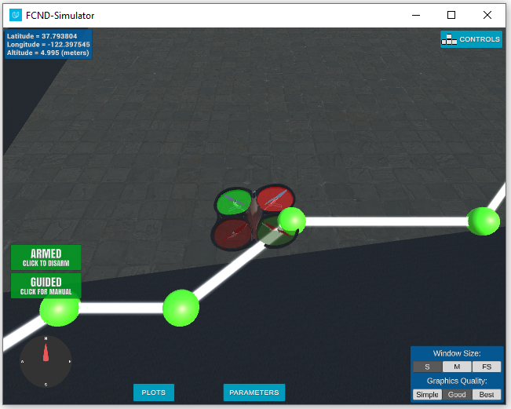

<html>

<head>
<meta http-equiv=Content-Type content="text/html; charset=windows-1252">
<link rel=File-List href="README_files/filelist.xml">
<link rel=Edit-Time-Data href="README_files/editdata.mso">
<!--[if !mso]>
<style>
v\:* {behavior:url(#default#VML);}
o\:* {behavior:url(#default#VML);}
w\:* {behavior:url(#default#VML);}
.shape {behavior:url(#default#VML);}
</style>
<![endif]--><!--[if gte mso 9]><xml>
 <o:DocumentProperties>
  <o:Author>compel@LIVE.CO.UK</o:Author>
  <o:Template>Normal</o:Template>
  <o:LastAuthor>compel@LIVE.CO.UK</o:LastAuthor>
  <o:Revision>2</o:Revision>
  <o:TotalTime>4</o:TotalTime>
  <o:Created>2021-05-17T21:22:00Z</o:Created>
  <o:LastSaved>2021-05-17T21:26:00Z</o:LastSaved>
  <o:Pages>5</o:Pages>
  <o:Words>1114</o:Words>
  <o:Characters>6353</o:Characters>
  <o:Lines>52</o:Lines>
  <o:Paragraphs>14</o:Paragraphs>
  <o:CharactersWithSpaces>7453</o:CharactersWithSpaces>
  <o:Version>11.9999</o:Version>
 </o:DocumentProperties>
</xml><![endif]--><!--[if gte mso 9]><xml>
 <w:WordDocument>
  <w:Zoom>160</w:Zoom>
  <w:SpellingState>Clean</w:SpellingState>
  <w:ValidateAgainstSchemas/>
  <w:SaveIfXMLInvalid>false</w:SaveIfXMLInvalid>
  <w:IgnoreMixedContent>false</w:IgnoreMixedContent>
  <w:AlwaysShowPlaceholderText>false</w:AlwaysShowPlaceholderText>
  <w:BrowserLevel>MicrosoftInternetExplorer4</w:BrowserLevel>
 </w:WordDocument>
</xml><![endif]--><!--[if gte mso 9]><xml>
 <w:LatentStyles DefLockedState="false" LatentStyleCount="156">
 </w:LatentStyles>
</xml><![endif]-->
<style>
<!--p.MSONORMAL
	{mso-style-unhide:no;
	mso-style-qformat:yes;}
li.MSONORMAL
	{mso-style-unhide:no;
	mso-style-qformat:yes;}
div.MSONORMAL
	{mso-style-unhide:no;
	mso-style-qformat:yes;}
a:link
	{mso-style-unhide:no;
	mso-themecolor:hyperlink;}
span.MSOHYPERLINK
	{mso-style-unhide:no;
	mso-themecolor:hyperlink;}
a:visited
	{mso-style-unhide:no;
	mso-themecolor:followedhyperlink;}
span.MSOHYPERLINKFOLLOWED
	{mso-style-unhide:no;
	mso-themecolor:followedhyperlink;}
p.MSONORMAL0
	{mso-style-unhide:no;
	mso-fareast-theme-font:minor-fareast;}
li.MSONORMAL0
	{mso-style-unhide:no;
	mso-fareast-theme-font:minor-fareast;}
div.MSONORMAL0
	{mso-style-unhide:no;
	mso-fareast-theme-font:minor-fareast;}
.MSOCHPDEFAULT
	{mso-default-props:yes;}
table.MSONORMALTABLE
	{mso-style-priority:99;}

 /* Style Definitions */
 p.MsoNormal, li.MsoNormal, div.MsoNormal
	{mso-style-parent:"";
	margin:0cm;
	margin-bottom:.0001pt;
	mso-pagination:widow-orphan;
	font-size:12.0pt;
	font-family:"Times New Roman";
	mso-fareast-font-family:"Times New Roman";}
a:link, span.MsoHyperlink
	{color:#0563C1;
	text-decoration:underline;
	text-underline:single;}
a:visited, span.MsoHyperlinkFollowed
	{color:#954F72;
	text-decoration:underline;
	text-underline:single;}
p.msonormal0, li.msonormal0, div.msonormal0
	{mso-style-name:msonormal;
	mso-margin-top-alt:auto;
	margin-right:0cm;
	mso-margin-bottom-alt:auto;
	margin-left:0cm;
	mso-pagination:widow-orphan;
	font-size:12.0pt;
	font-family:"Times New Roman";
	mso-fareast-font-family:"Times New Roman";}
span.SpellE
	{mso-style-name:"";
	mso-spl-e:yes;}
@page Section1
	{size:595.3pt 841.9pt;
	margin:72.0pt 90.0pt 72.0pt 90.0pt;
	mso-header-margin:35.4pt;
	mso-footer-margin:35.4pt;
	mso-paper-source:0;}
div.Section1
	{page:Section1;}
-->
</style>
<!--[if gte mso 10]>
<style>
 /* Style Definitions */
 table.MsoNormalTable
	{mso-style-name:"Table Normal";
	mso-tstyle-rowband-size:0;
	mso-tstyle-colband-size:0;
	mso-style-noshow:yes;
	mso-style-parent:"";
	mso-padding-alt:0cm 5.4pt 0cm 5.4pt;
	mso-para-margin:0cm;
	mso-para-margin-bottom:.0001pt;
	mso-pagination:widow-orphan;
	font-size:10.0pt;
	font-family:"Times New Roman";
	mso-ansi-language:#0400;
	mso-fareast-language:#0400;
	mso-bidi-language:#0400;}
</style>
<![endif]--><!--[if gte mso 9]><xml>
 <u1:DocumentProperties>
  <u1:Author>compel UK</u1:Author>
  <u1:Template>Normal</u1:Template>
  <u1:LastAuthor>compel UK</u1:LastAuthor>
  <u1:Revision>2</u1:Revision>
  <u1:TotalTime>312</u1:TotalTime>
  <u1:Created>2021-05-17T20:57:00Z</u1:Created>
  <u1:LastSaved>2021-05-17T20:57:00Z</u1:LastSaved>
  <u1:Pages>1</u1:Pages>
  <u1:Words>1061</u1:Words>
  <u1:Characters>6050</u1:Characters>
  <u1:Lines>50</u1:Lines>
  <u1:Paragraphs>14</u1:Paragraphs>
  <u1:CharactersWithSpaces>7097</u1:CharactersWithSpaces>
  <u1:Version>16.00</u1:Version>
 </u1:DocumentProperties>
</xml><![endif]--><!--[if gte mso 9]><xml>
 <u1:OfficeDocumentSettings>
  <u1:AllowPNG/>
 </u1:OfficeDocumentSettings>
</xml><![endif]-->
<link rel=themeData href="README_files/themedata.thmx">
<link rel=colorSchemeMapping href="README_files/colorschememapping.xml">
<!--[if gte mso 9]><xml>
 <u2:WordDocument>
  <u2:Zoom>170</u2:Zoom>
  <u2:SpellingState>Clean</u2:SpellingState>
  <u2:GrammarState>Clean</u2:GrammarState>
  <u2:TrackMoves>false</u2:TrackMoves>
  <u2:TrackFormatting/>
  <u2:PunctuationKerning/>
  <u2:ValidateAgainstSchemas/>
  <u2:SaveIfXMLInvalid>false</u2:SaveIfXMLInvalid>
  <u2:IgnoreMixedContent>false</u2:IgnoreMixedContent>
  <u2:AlwaysShowPlaceholderText>false</u2:AlwaysShowPlaceholderText>
  <u2:DoNotPromoteQF/>
  <u2:LidThemeOther>EN-GB</u2:LidThemeOther>
  <u2:LidThemeAsian>X-NONE</u2:LidThemeAsian>
  <u2:LidThemeComplexScript>AR-SA</u2:LidThemeComplexScript>
  <u2:Compatibility>
   <u2:BreakWrappedTables/>
   <u2:SnapToGridInCell/>
   <u2:WrapTextWithPunct/>
   <u2:UseAsianBreakRules/>
   <u2:DontGrowAutofit/>
   <u2:SplitPgBreakAndParaMark/>
   <u2:EnableOpenTypeKerning/>
   <u2:DontFlipMirrorIndents/>
   <u2:OverrideTableStyleHps/>
  </u2:Compatibility>
  <u2:BrowserLevel>MicrosoftInternetExplorer4</u2:BrowserLevel>
  <m:mathPr>
   <m:mathFont m:val="Cambria Math"/>
   <m:brkBin m:val="before"/>
   <m:brkBinSub m:val="--"/>
   <m:smallFrac m:val="off"/>
   <m:dispDef/>
   <m:lMargin m:val="0"/>
   <m:rMargin m:val="0"/>
   <m:defJc m:val="centerGroup"/>
   <m:wrapIndent m:val="1440"/>
   <m:intLim m:val="subSup"/>
   <m:naryLim m:val="undOvr"/>
  </m:mathPr>
 </u2:WordDocument>
</xml><![endif]--><!--[if gte mso 9]><xml>
 <u3:LatentStyles DefLockedState="false" DefUnhideWhenUsed="false" DefSemiHidden="false" DefQFormat="false" LatentStyleCount="376">
  <u3:LsdException Locked="false" QFormat="true" Name="Normal"/>
  <u3:LsdException Locked="false" QFormat="true" Name="heading 1"/>
  <u3:LsdException Locked="false" SemiHidden="true" UnhideWhenUsed="true" QFormat="true" Name="heading 2"/>
  <u3:LsdException Locked="false" SemiHidden="true" UnhideWhenUsed="true" QFormat="true" Name="heading 3"/>
  <u3:LsdException Locked="false" SemiHidden="true" UnhideWhenUsed="true" QFormat="true" Name="heading 4"/>
  <u3:LsdException Locked="false" SemiHidden="true" UnhideWhenUsed="true" QFormat="true" Name="heading 5"/>
  <u3:LsdException Locked="false" SemiHidden="true" UnhideWhenUsed="true" QFormat="true" Name="heading 6"/>
  <u3:LsdException Locked="false" SemiHidden="true" UnhideWhenUsed="true" QFormat="true" Name="heading 7"/>
  <u3:LsdException Locked="false" SemiHidden="true" UnhideWhenUsed="true" QFormat="true" Name="heading 8"/>
  <u3:LsdException Locked="false" SemiHidden="true" UnhideWhenUsed="true" QFormat="true" Name="heading 9"/>
  <u3:LsdException Locked="false" SemiHidden="true" UnhideWhenUsed="true" QFormat="true" Name="caption"/>
  <u3:LsdException Locked="false" QFormat="true" Name="Title"/>
  <u3:LsdException Locked="false" Priority="1" Name="Default Paragraph Font"/>
  <u3:LsdException Locked="false" QFormat="true" Name="Subtitle"/>
  <u3:LsdException Locked="false" QFormat="true" Name="Strong"/>
  <u3:LsdException Locked="false" QFormat="true" Name="Emphasis"/>
  <u3:LsdException Locked="false" SemiHidden="true" UnhideWhenUsed="true" Name="HTML Variable"/>
  <u3:LsdException Locked="false" SemiHidden="true" UnhideWhenUsed="true" Name="Normal Table"/>
  <u3:LsdException Locked="false" Priority="99" Name="No List"/>
  <u3:LsdException Locked="false" SemiHidden="true" UnhideWhenUsed="true" Name="Outline List 3"/>
  <u3:LsdException Locked="false" SemiHidden="true" UnhideWhenUsed="true" Name="Table Simple 1"/>
  <u3:LsdException Locked="false" SemiHidden="true" UnhideWhenUsed="true" Name="Table Simple 2"/>
  <u3:LsdException Locked="false" SemiHidden="true" UnhideWhenUsed="true" Name="Table Simple 3"/>
  <u3:LsdException Locked="false" SemiHidden="true" UnhideWhenUsed="true" Name="Table Classic 1"/>
  <u3:LsdException Locked="false" SemiHidden="true" UnhideWhenUsed="true" Name="Table Classic 2"/>
  <u3:LsdException Locked="false" SemiHidden="true" UnhideWhenUsed="true" Name="Table Classic 3"/>
  <u3:LsdException Locked="false" SemiHidden="true" UnhideWhenUsed="true" Name="Table Classic 4"/>
  <u3:LsdException Locked="false" SemiHidden="true" UnhideWhenUsed="true" Name="Table Colorful 1"/>
  <u3:LsdException Locked="false" SemiHidden="true" UnhideWhenUsed="true" Name="Table Colorful 2"/>
  <u3:LsdException Locked="false" SemiHidden="true" UnhideWhenUsed="true" Name="Table Colorful 3"/>
  <u3:LsdException Locked="false" SemiHidden="true" UnhideWhenUsed="true" Name="Table Columns 1"/>
  <u3:LsdException Locked="false" SemiHidden="true" UnhideWhenUsed="true" Name="Table Columns 2"/>
  <u3:LsdException Locked="false" SemiHidden="true" UnhideWhenUsed="true" Name="Table Columns 3"/>
  <u3:LsdException Locked="false" SemiHidden="true" UnhideWhenUsed="true" Name="Table Columns 4"/>
  <u3:LsdException Locked="false" SemiHidden="true" UnhideWhenUsed="true" Name="Table Columns 5"/>
  <u3:LsdException Locked="false" SemiHidden="true" UnhideWhenUsed="true" Name="Table Grid 1"/>
  <u3:LsdException Locked="false" SemiHidden="true" UnhideWhenUsed="true" Name="Table Grid 2"/>
  <u3:LsdException Locked="false" SemiHidden="true" UnhideWhenUsed="true" Name="Table Grid 3"/>
  <u3:LsdException Locked="false" SemiHidden="true" UnhideWhenUsed="true" Name="Table Grid 4"/>
  <u3:LsdException Locked="false" SemiHidden="true" UnhideWhenUsed="true" Name="Table Grid 5"/>
  <u3:LsdException Locked="false" SemiHidden="true" UnhideWhenUsed="true" Name="Table Grid 6"/>
  <u3:LsdException Locked="false" SemiHidden="true" UnhideWhenUsed="true" Name="Table Grid 7"/>
  <u3:LsdException Locked="false" SemiHidden="true" UnhideWhenUsed="true" Name="Table Grid 8"/>
  <u3:LsdException Locked="false" SemiHidden="true" UnhideWhenUsed="true" Name="Table List 1"/>
  <u3:LsdException Locked="false" SemiHidden="true" UnhideWhenUsed="true" Name="Table List 2"/>
  <u3:LsdException Locked="false" SemiHidden="true" UnhideWhenUsed="true" Name="Table List 3"/>
  <u3:LsdException Locked="false" SemiHidden="true" UnhideWhenUsed="true" Name="Table List 4"/>
  <u3:LsdException Locked="false" SemiHidden="true" UnhideWhenUsed="true" Name="Table List 5"/>
  <u3:LsdException Locked="false" SemiHidden="true" UnhideWhenUsed="true" Name="Table List 6"/>
  <u3:LsdException Locked="false" SemiHidden="true" UnhideWhenUsed="true" Name="Table List 7"/>
  <u3:LsdException Locked="false" SemiHidden="true" UnhideWhenUsed="true" Name="Table List 8"/>
  <u3:LsdException Locked="false" SemiHidden="true" UnhideWhenUsed="true" Name="Table 3D effects 1"/>
  <u3:LsdException Locked="false" SemiHidden="true" UnhideWhenUsed="true" Name="Table 3D effects 2"/>
  <u3:LsdException Locked="false" SemiHidden="true" UnhideWhenUsed="true" Name="Table 3D effects 3"/>
  <u3:LsdException Locked="false" SemiHidden="true" UnhideWhenUsed="true" Name="Table Contemporary"/>
  <u3:LsdException Locked="false" SemiHidden="true" UnhideWhenUsed="true" Name="Table Elegant"/>
  <u3:LsdException Locked="false" SemiHidden="true" UnhideWhenUsed="true" Name="Table Professional"/>
  <u3:LsdException Locked="false" SemiHidden="true" UnhideWhenUsed="true" Name="Table Subtle 1"/>
  <u3:LsdException Locked="false" SemiHidden="true" UnhideWhenUsed="true" Name="Table Subtle 2"/>
  <u3:LsdException Locked="false" SemiHidden="true" UnhideWhenUsed="true" Name="Table Web 1"/>
  <u3:LsdException Locked="false" SemiHidden="true" UnhideWhenUsed="true" Name="Table Web 2"/>
  <u3:LsdException Locked="false" SemiHidden="true" UnhideWhenUsed="true" Name="Table Web 3"/>
  <u3:LsdException Locked="false" SemiHidden="true" UnhideWhenUsed="true" Name="Balloon Text"/>
  <u3:LsdException Locked="false" SemiHidden="true" UnhideWhenUsed="true" Name="Table Theme"/>
  <u3:LsdException Locked="false" Priority="99" SemiHidden="true" Name="Placeholder Text"/>
  <u3:LsdException Locked="false" Priority="1" QFormat="true" Name="No Spacing"/>
  <u3:LsdException Locked="false" Priority="60" Name="Light Shading"/>
  <u3:LsdException Locked="false" Priority="61" Name="Light List"/>
  <u3:LsdException Locked="false" Priority="62" Name="Light Grid"/>
  <u3:LsdException Locked="false" Priority="63" Name="Medium Shading 1"/>
  <u3:LsdException Locked="false" Priority="64" Name="Medium Shading 2"/>
  <u3:LsdException Locked="false" Priority="65" Name="Medium List 1"/>
  <u3:LsdException Locked="false" Priority="66" Name="Medium List 2"/>
  <u3:LsdException Locked="false" Priority="67" Name="Medium Grid 1"/>
  <u3:LsdException Locked="false" Priority="68" Name="Medium Grid 2"/>
  <u3:LsdException Locked="false" Priority="69" Name="Medium Grid 3"/>
  <u3:LsdException Locked="false" Priority="70" Name="Dark List"/>
  <u3:LsdException Locked="false" Priority="71" Name="Colorful Shading"/>
  <u3:LsdException Locked="false" Priority="72" Name="Colorful List"/>
  <u3:LsdException Locked="false" Priority="73" Name="Colorful Grid"/>
  <u3:LsdException Locked="false" Priority="60" Name="Light Shading Accent 1"/>
  <u3:LsdException Locked="false" Priority="61" Name="Light List Accent 1"/>
  <u3:LsdException Locked="false" Priority="62" Name="Light Grid Accent 1"/>
  <u3:LsdException Locked="false" Priority="63" Name="Medium Shading 1 Accent 1"/>
  <u3:LsdException Locked="false" Priority="64" Name="Medium Shading 2 Accent 1"/>
  <u3:LsdException Locked="false" Priority="65" Name="Medium List 1 Accent 1"/>
  <u3:LsdException Locked="false" Priority="99" SemiHidden="true" Name="Revision"/>
  <u3:LsdException Locked="false" Priority="34" QFormat="true" Name="List Paragraph"/>
  <u3:LsdException Locked="false" Priority="29" QFormat="true" Name="Quote"/>
  <u3:LsdException Locked="false" Priority="30" QFormat="true" Name="Intense Quote"/>
  <u3:LsdException Locked="false" Priority="66" Name="Medium List 2 Accent 1"/>
  <u3:LsdException Locked="false" Priority="67" Name="Medium Grid 1 Accent 1"/>
  <u3:LsdException Locked="false" Priority="68" Name="Medium Grid 2 Accent 1"/>
  <u3:LsdException Locked="false" Priority="69" Name="Medium Grid 3 Accent 1"/>
  <u3:LsdException Locked="false" Priority="70" Name="Dark List Accent 1"/>
  <u3:LsdException Locked="false" Priority="71" Name="Colorful Shading Accent 1"/>
  <u3:LsdException Locked="false" Priority="72" Name="Colorful List Accent 1"/>
  <u3:LsdException Locked="false" Priority="73" Name="Colorful Grid Accent 1"/>
  <u3:LsdException Locked="false" Priority="60" Name="Light Shading Accent 2"/>
  <u3:LsdException Locked="false" Priority="61" Name="Light List Accent 2"/>
  <u3:LsdException Locked="false" Priority="62" Name="Light Grid Accent 2"/>
  <u3:LsdException Locked="false" Priority="63" Name="Medium Shading 1 Accent 2"/>
  <u3:LsdException Locked="false" Priority="64" Name="Medium Shading 2 Accent 2"/>
  <u3:LsdException Locked="false" Priority="65" Name="Medium List 1 Accent 2"/>
  <u3:LsdException Locked="false" Priority="66" Name="Medium List 2 Accent 2"/>
  <u3:LsdException Locked="false" Priority="67" Name="Medium Grid 1 Accent 2"/>
  <u3:LsdException Locked="false" Priority="68" Name="Medium Grid 2 Accent 2"/>
  <u3:LsdException Locked="false" Priority="69" Name="Medium Grid 3 Accent 2"/>
  <u3:LsdException Locked="false" Priority="70" Name="Dark List Accent 2"/>
  <u3:LsdException Locked="false" Priority="71" Name="Colorful Shading Accent 2"/>
  <u3:LsdException Locked="false" Priority="72" Name="Colorful List Accent 2"/>
  <u3:LsdException Locked="false" Priority="73" Name="Colorful Grid Accent 2"/>
  <u3:LsdException Locked="false" Priority="60" Name="Light Shading Accent 3"/>
  <u3:LsdException Locked="false" Priority="61" Name="Light List Accent 3"/>
  <u3:LsdException Locked="false" Priority="62" Name="Light Grid Accent 3"/>
  <u3:LsdException Locked="false" Priority="63" Name="Medium Shading 1 Accent 3"/>
  <u3:LsdException Locked="false" Priority="64" Name="Medium Shading 2 Accent 3"/>
  <u3:LsdException Locked="false" Priority="65" Name="Medium List 1 Accent 3"/>
  <u3:LsdException Locked="false" Priority="66" Name="Medium List 2 Accent 3"/>
  <u3:LsdException Locked="false" Priority="67" Name="Medium Grid 1 Accent 3"/>
  <u3:LsdException Locked="false" Priority="68" Name="Medium Grid 2 Accent 3"/>
  <u3:LsdException Locked="false" Priority="69" Name="Medium Grid 3 Accent 3"/>
  <u3:LsdException Locked="false" Priority="70" Name="Dark List Accent 3"/>
  <u3:LsdException Locked="false" Priority="71" Name="Colorful Shading Accent 3"/>
  <u3:LsdException Locked="false" Priority="72" Name="Colorful List Accent 3"/>
  <u3:LsdException Locked="false" Priority="73" Name="Colorful Grid Accent 3"/>
  <u3:LsdException Locked="false" Priority="60" Name="Light Shading Accent 4"/>
  <u3:LsdException Locked="false" Priority="61" Name="Light List Accent 4"/>
  <u3:LsdException Locked="false" Priority="62" Name="Light Grid Accent 4"/>
  <u3:LsdException Locked="false" Priority="63" Name="Medium Shading 1 Accent 4"/>
  <u3:LsdException Locked="false" Priority="64" Name="Medium Shading 2 Accent 4"/>
  <u3:LsdException Locked="false" Priority="65" Name="Medium List 1 Accent 4"/>
  <u3:LsdException Locked="false" Priority="66" Name="Medium List 2 Accent 4"/>
  <u3:LsdException Locked="false" Priority="67" Name="Medium Grid 1 Accent 4"/>
  <u3:LsdException Locked="false" Priority="68" Name="Medium Grid 2 Accent 4"/>
  <u3:LsdException Locked="false" Priority="69" Name="Medium Grid 3 Accent 4"/>
  <u3:LsdException Locked="false" Priority="70" Name="Dark List Accent 4"/>
  <u3:LsdException Locked="false" Priority="71" Name="Colorful Shading Accent 4"/>
  <u3:LsdException Locked="false" Priority="72" Name="Colorful List Accent 4"/>
  <u3:LsdException Locked="false" Priority="73" Name="Colorful Grid Accent 4"/>
  <u3:LsdException Locked="false" Priority="60" Name="Light Shading Accent 5"/>
  <u3:LsdException Locked="false" Priority="61" Name="Light List Accent 5"/>
  <u3:LsdException Locked="false" Priority="62" Name="Light Grid Accent 5"/>
  <u3:LsdException Locked="false" Priority="63" Name="Medium Shading 1 Accent 5"/>
  <u3:LsdException Locked="false" Priority="64" Name="Medium Shading 2 Accent 5"/>
  <u3:LsdException Locked="false" Priority="65" Name="Medium List 1 Accent 5"/>
  <u3:LsdException Locked="false" Priority="66" Name="Medium List 2 Accent 5"/>
  <u3:LsdException Locked="false" Priority="67" Name="Medium Grid 1 Accent 5"/>
  <u3:LsdException Locked="false" Priority="68" Name="Medium Grid 2 Accent 5"/>
  <u3:LsdException Locked="false" Priority="69" Name="Medium Grid 3 Accent 5"/>
  <u3:LsdException Locked="false" Priority="70" Name="Dark List Accent 5"/>
  <u3:LsdException Locked="false" Priority="71" Name="Colorful Shading Accent 5"/>
  <u3:LsdException Locked="false" Priority="72" Name="Colorful List Accent 5"/>
  <u3:LsdException Locked="false" Priority="73" Name="Colorful Grid Accent 5"/>
  <u3:LsdException Locked="false" Priority="60" Name="Light Shading Accent 6"/>
  <u3:LsdException Locked="false" Priority="61" Name="Light List Accent 6"/>
  <u3:LsdException Locked="false" Priority="62" Name="Light Grid Accent 6"/>
  <u3:LsdException Locked="false" Priority="63" Name="Medium Shading 1 Accent 6"/>
  <u3:LsdException Locked="false" Priority="64" Name="Medium Shading 2 Accent 6"/>
  <u3:LsdException Locked="false" Priority="65" Name="Medium List 1 Accent 6"/>
  <u3:LsdException Locked="false" Priority="66" Name="Medium List 2 Accent 6"/>
  <u3:LsdException Locked="false" Priority="67" Name="Medium Grid 1 Accent 6"/>
  <u3:LsdException Locked="false" Priority="68" Name="Medium Grid 2 Accent 6"/>
  <u3:LsdException Locked="false" Priority="69" Name="Medium Grid 3 Accent 6"/>
  <u3:LsdException Locked="false" Priority="70" Name="Dark List Accent 6"/>
  <u3:LsdException Locked="false" Priority="71" Name="Colorful Shading Accent 6"/>
  <u3:LsdException Locked="false" Priority="72" Name="Colorful List Accent 6"/>
  <u3:LsdException Locked="false" Priority="73" Name="Colorful Grid Accent 6"/>
  <u3:LsdException Locked="false" Priority="19" QFormat="true" Name="Subtle Emphasis"/>
  <u3:LsdException Locked="false" Priority="21" QFormat="true" Name="Intense Emphasis"/>
  <u3:LsdException Locked="false" Priority="31" QFormat="true" Name="Subtle Reference"/>
  <u3:LsdException Locked="false" Priority="32" QFormat="true" Name="Intense Reference"/>
  <u3:LsdException Locked="false" Priority="33" QFormat="true" Name="Book Title"/>
  <u3:LsdException Locked="false" Priority="37" SemiHidden="true" UnhideWhenUsed="true" Name="Bibliography"/>
  <u3:LsdException Locked="false" Priority="39" SemiHidden="true" UnhideWhenUsed="true" QFormat="true" Name="TOC Heading"/>
  <u3:LsdException Locked="false" Priority="41" Name="Plain Table 1"/>
  <u3:LsdException Locked="false" Priority="42" Name="Plain Table 2"/>
  <u3:LsdException Locked="false" Priority="43" Name="Plain Table 3"/>
  <u3:LsdException Locked="false" Priority="44" Name="Plain Table 4"/>
  <u3:LsdException Locked="false" Priority="45" Name="Plain Table 5"/>
  <u3:LsdException Locked="false" Priority="40" Name="Grid Table Light"/>
  <u3:LsdException Locked="false" Priority="46" Name="Grid Table 1 Light"/>
  <u3:LsdException Locked="false" Priority="47" Name="Grid Table 2"/>
  <u3:LsdException Locked="false" Priority="48" Name="Grid Table 3"/>
  <u3:LsdException Locked="false" Priority="49" Name="Grid Table 4"/>
  <u3:LsdException Locked="false" Priority="50" Name="Grid Table 5 Dark"/>
  <u3:LsdException Locked="false" Priority="51" Name="Grid Table 6 Colorful"/>
  <u3:LsdException Locked="false" Priority="52" Name="Grid Table 7 Colorful"/>
  <u3:LsdException Locked="false" Priority="46" Name="Grid Table 1 Light Accent 1"/>
  <u3:LsdException Locked="false" Priority="47" Name="Grid Table 2 Accent 1"/>
  <u3:LsdException Locked="false" Priority="48" Name="Grid Table 3 Accent 1"/>
  <u3:LsdException Locked="false" Priority="49" Name="Grid Table 4 Accent 1"/>
  <u3:LsdException Locked="false" Priority="50" Name="Grid Table 5 Dark Accent 1"/>
  <u3:LsdException Locked="false" Priority="51" Name="Grid Table 6 Colorful Accent 1"/>
  <u3:LsdException Locked="false" Priority="52" Name="Grid Table 7 Colorful Accent 1"/>
  <u3:LsdException Locked="false" Priority="46" Name="Grid Table 1 Light Accent 2"/>
  <u3:LsdException Locked="false" Priority="47" Name="Grid Table 2 Accent 2"/>
  <u3:LsdException Locked="false" Priority="48" Name="Grid Table 3 Accent 2"/>
  <u3:LsdException Locked="false" Priority="49" Name="Grid Table 4 Accent 2"/>
  <u3:LsdException Locked="false" Priority="50" Name="Grid Table 5 Dark Accent 2"/>
  <u3:LsdException Locked="false" Priority="51" Name="Grid Table 6 Colorful Accent 2"/>
  <u3:LsdException Locked="false" Priority="52" Name="Grid Table 7 Colorful Accent 2"/>
  <u3:LsdException Locked="false" Priority="46" Name="Grid Table 1 Light Accent 3"/>
  <u3:LsdException Locked="false" Priority="47" Name="Grid Table 2 Accent 3"/>
  <u3:LsdException Locked="false" Priority="48" Name="Grid Table 3 Accent 3"/>
  <u3:LsdException Locked="false" Priority="49" Name="Grid Table 4 Accent 3"/>
  <u3:LsdException Locked="false" Priority="50" Name="Grid Table 5 Dark Accent 3"/>
  <u3:LsdException Locked="false" Priority="51" Name="Grid Table 6 Colorful Accent 3"/>
  <u3:LsdException Locked="false" Priority="52" Name="Grid Table 7 Colorful Accent 3"/>
  <u3:LsdException Locked="false" Priority="46" Name="Grid Table 1 Light Accent 4"/>
  <u3:LsdException Locked="false" Priority="47" Name="Grid Table 2 Accent 4"/>
  <u3:LsdException Locked="false" Priority="48" Name="Grid Table 3 Accent 4"/>
  <u3:LsdException Locked="false" Priority="49" Name="Grid Table 4 Accent 4"/>
  <u3:LsdException Locked="false" Priority="50" Name="Grid Table 5 Dark Accent 4"/>
  <u3:LsdException Locked="false" Priority="51" Name="Grid Table 6 Colorful Accent 4"/>
  <u3:LsdException Locked="false" Priority="52" Name="Grid Table 7 Colorful Accent 4"/>
  <u3:LsdException Locked="false" Priority="46" Name="Grid Table 1 Light Accent 5"/>
  <u3:LsdException Locked="false" Priority="47" Name="Grid Table 2 Accent 5"/>
  <u3:LsdException Locked="false" Priority="48" Name="Grid Table 3 Accent 5"/>
  <u3:LsdException Locked="false" Priority="49" Name="Grid Table 4 Accent 5"/>
  <u3:LsdException Locked="false" Priority="50" Name="Grid Table 5 Dark Accent 5"/>
  <u3:LsdException Locked="false" Priority="51" Name="Grid Table 6 Colorful Accent 5"/>
  <u3:LsdException Locked="false" Priority="52" Name="Grid Table 7 Colorful Accent 5"/>
  <u3:LsdException Locked="false" Priority="46" Name="Grid Table 1 Light Accent 6"/>
  <u3:LsdException Locked="false" Priority="47" Name="Grid Table 2 Accent 6"/>
  <u3:LsdException Locked="false" Priority="48" Name="Grid Table 3 Accent 6"/>
  <u3:LsdException Locked="false" Priority="49" Name="Grid Table 4 Accent 6"/>
  <u3:LsdException Locked="false" Priority="50" Name="Grid Table 5 Dark Accent 6"/>
  <u3:LsdException Locked="false" Priority="51" Name="Grid Table 6 Colorful Accent 6"/>
  <u3:LsdException Locked="false" Priority="52" Name="Grid Table 7 Colorful Accent 6"/>
  <u3:LsdException Locked="false" Priority="46" Name="List Table 1 Light"/>
  <u3:LsdException Locked="false" Priority="47" Name="List Table 2"/>
  <u3:LsdException Locked="false" Priority="48" Name="List Table 3"/>
  <u3:LsdException Locked="false" Priority="49" Name="List Table 4"/>
  <u3:LsdException Locked="false" Priority="50" Name="List Table 5 Dark"/>
  <u3:LsdException Locked="false" Priority="51" Name="List Table 6 Colorful"/>
  <u3:LsdException Locked="false" Priority="52" Name="List Table 7 Colorful"/>
  <u3:LsdException Locked="false" Priority="46" Name="List Table 1 Light Accent 1"/>
  <u3:LsdException Locked="false" Priority="47" Name="List Table 2 Accent 1"/>
  <u3:LsdException Locked="false" Priority="48" Name="List Table 3 Accent 1"/>
  <u3:LsdException Locked="false" Priority="49" Name="List Table 4 Accent 1"/>
  <u3:LsdException Locked="false" Priority="50" Name="List Table 5 Dark Accent 1"/>
  <u3:LsdException Locked="false" Priority="51" Name="List Table 6 Colorful Accent 1"/>
  <u3:LsdException Locked="false" Priority="52" Name="List Table 7 Colorful Accent 1"/>
  <u3:LsdException Locked="false" Priority="46" Name="List Table 1 Light Accent 2"/>
  <u3:LsdException Locked="false" Priority="47" Name="List Table 2 Accent 2"/>
  <u3:LsdException Locked="false" Priority="48" Name="List Table 3 Accent 2"/>
  <u3:LsdException Locked="false" Priority="49" Name="List Table 4 Accent 2"/>
  <u3:LsdException Locked="false" Priority="50" Name="List Table 5 Dark Accent 2"/>
  <u3:LsdException Locked="false" Priority="51" Name="List Table 6 Colorful Accent 2"/>
  <u3:LsdException Locked="false" Priority="52" Name="List Table 7 Colorful Accent 2"/>
  <u3:LsdException Locked="false" Priority="46" Name="List Table 1 Light Accent 3"/>
  <u3:LsdException Locked="false" Priority="47" Name="List Table 2 Accent 3"/>
  <u3:LsdException Locked="false" Priority="48" Name="List Table 3 Accent 3"/>
  <u3:LsdException Locked="false" Priority="49" Name="List Table 4 Accent 3"/>
  <u3:LsdException Locked="false" Priority="50" Name="List Table 5 Dark Accent 3"/>
  <u3:LsdException Locked="false" Priority="51" Name="List Table 6 Colorful Accent 3"/>
  <u3:LsdException Locked="false" Priority="52" Name="List Table 7 Colorful Accent 3"/>
  <u3:LsdException Locked="false" Priority="46" Name="List Table 1 Light Accent 4"/>
  <u3:LsdException Locked="false" Priority="47" Name="List Table 2 Accent 4"/>
  <u3:LsdException Locked="false" Priority="48" Name="List Table 3 Accent 4"/>
  <u3:LsdException Locked="false" Priority="49" Name="List Table 4 Accent 4"/>
  <u3:LsdException Locked="false" Priority="50" Name="List Table 5 Dark Accent 4"/>
  <u3:LsdException Locked="false" Priority="51" Name="List Table 6 Colorful Accent 4"/>
  <u3:LsdException Locked="false" Priority="52" Name="List Table 7 Colorful Accent 4"/>
  <u3:LsdException Locked="false" Priority="46" Name="List Table 1 Light Accent 5"/>
  <u3:LsdException Locked="false" Priority="47" Name="List Table 2 Accent 5"/>
  <u3:LsdException Locked="false" Priority="48" Name="List Table 3 Accent 5"/>
  <u3:LsdException Locked="false" Priority="49" Name="List Table 4 Accent 5"/>
  <u3:LsdException Locked="false" Priority="50" Name="List Table 5 Dark Accent 5"/>
  <u3:LsdException Locked="false" Priority="51" Name="List Table 6 Colorful Accent 5"/>
  <u3:LsdException Locked="false" Priority="52" Name="List Table 7 Colorful Accent 5"/>
  <u3:LsdException Locked="false" Priority="46" Name="List Table 1 Light Accent 6"/>
  <u3:LsdException Locked="false" Priority="47" Name="List Table 2 Accent 6"/>
  <u3:LsdException Locked="false" Priority="48" Name="List Table 3 Accent 6"/>
  <u3:LsdException Locked="false" Priority="49" Name="List Table 4 Accent 6"/>
  <u3:LsdException Locked="false" Priority="50" Name="List Table 5 Dark Accent 6"/>
  <u3:LsdException Locked="false" Priority="51" Name="List Table 6 Colorful Accent 6"/>
  <u3:LsdException Locked="false" Priority="52" Name="List Table 7 Colorful Accent 6"/>
  <u3:LsdException Locked="false" Priority="99" SemiHidden="true" UnhideWhenUsed="true" Name="Mention"/>
  <u3:LsdException Locked="false" Priority="99" SemiHidden="true" UnhideWhenUsed="true" Name="Smart Hyperlink"/>
  <u3:LsdException Locked="false" Priority="99" SemiHidden="true" UnhideWhenUsed="true" Name="Hashtag"/>
  <u3:LsdException Locked="false" Priority="99" SemiHidden="true" UnhideWhenUsed="true" Name="Unresolved Mention"/>
  <u3:LsdException Locked="false" Priority="99" SemiHidden="true" UnhideWhenUsed="true" Name="Smart Link"/>
 </u3:LatentStyles>
</xml><![endif]--><!--[if gte mso 9]><xml>
 <u4:shapedefaults u5:ext="edit" spidmax="1029"/>
</xml><![endif]--><!--[if gte mso 9]><xml>
 <u6:shapelayout u7:ext="edit">
  <u6:idmap u7:ext="edit" data="1"/>
 </u6:shapelayout>
</xml><![endif]--><!--[if gte mso 9]><xml>
 <o:shapedefaults v:ext="edit" spidmax="1026"/>
</xml><![endif]--><!--[if gte mso 9]><xml>
 <o:shapelayout v:ext="edit">
  <o:idmap v:ext="edit" data="1"/>
 </o:shapelayout></xml><![endif]-->
</head>

<body lang=EN-GB link="#0563C1" vlink="#954F72" style='tab-interval:36.0pt;
word-wrap:break-word'>

<div class=Section1>

<p class=MsoNormal align=center style='text-align:center'><b><span
style='font-size:17.0pt;font-family:Arial'>Project: 3D Motion Planning<u8:p></u8:p></span></span></b><span
style='font-family:Arial'><o:p></o:p></span></p>

<p class=MsoNormal><span style='mso-ascii-theme-font:minor-bidi;mso-hansi-theme-font:minor-bidi;
mso-bidi-theme-font:minor-bidi'><u8:p><span style='font-family:Arial'>&nbsp;</u8:p></span><o:p></o:p></span></p>

<p class=MsoNormal><u8:wrapblock><u9:shapetype id="_x0000_t75" coordsize="21600,21600" u8:spt="75" u8:preferrelative="t" path="m@4@5l@4@11@9@11@9@5xe" filled="f" stroked="f"><u9:stroke joinstyle="miter"/><u9:formulas><u9:f eqn="if lineDrawn pixelLineWidth 0"/><u9:f eqn="sum @0 1 0"/><u9:f eqn="sum 0 0 @1"/><u9:f eqn="prod @2 1 2"/><u9:f eqn="prod @3 21600 pixelWidth"/><u9:f eqn="prod @3 21600 pixelHeight"/><u9:f eqn="sum @0 0 1"/><u9:f eqn="prod @6 1 2"/><u9:f eqn="prod @7 21600 pixelWidth"/><u9:f eqn="sum @8 21600 0"/><u9:f eqn="prod @7 21600 pixelHeight"/><u9:f eqn="sum @10 21600 0"/></u9:formulas><u9:path u8:extrusionok="f" gradientshapeok="t" u8:connecttype="rect"/><u8:lock u9:ext="edit" aspectratio="t"/></u9:shapetype><u9:shape id="Picture_x0020_1" u8:spid="_x0000_s1028" type="#_x0000_t75" style="position:absolute;margin-left:88.5pt;margin-top:11.2pt;width:876pt;&#13;&#10;  height:657pt;z-index:-251658240;visibility:visible;mso-wrap-style:square;&#13;&#10;  mso-width-percent:0;mso-height-percent:0;mso-wrap-distance-left:9pt;&#13;&#10;  mso-wrap-distance-top:0;mso-wrap-distance-right:9pt;&#13;&#10;  mso-wrap-distance-bottom:0;mso-position-horizontal:absolute;&#13;&#10;  mso-position-horizontal-relative:text;mso-position-vertical:absolute;&#13;&#10;  mso-position-vertical-relative:text;mso-width-percent:0;mso-height-percent:0;&#13;&#10;  mso-width-relative:margin;mso-height-relative:margin"><u9:imagedata src="README_files/image001.png" u8:title=""/><u10:wrap type="topAndBottom"/></u9:shape><span
style='font-family:Arial'><o:p></o:p></span></p>

</u8:wrapblock><span style='mso-ascii-theme-font:minor-bidi;mso-hansi-theme-font:minor-bidi;
mso-bidi-theme-font:minor-bidi'><u8:p></u8:p></span>

<p class=MsoNormal><span style='mso-ascii-theme-font:minor-bidi;mso-hansi-theme-font:minor-bidi;
mso-bidi-theme-font:minor-bidi'><u8:p><span style='font-family:Arial'>&nbsp;</u8:p></span>&nbsp;</u8:p></span>---<u8:p></u8:p></span><o:p></o:p></span></p>

<p class=MsoNormal><b><span style='mso-ascii-theme-font:minor-bidi;mso-hansi-theme-font:minor-bidi;
mso-bidi-theme-font:minor-bidi'><span style='font-size:14.0pt;font-family:Arial'>Overview<u8:p></u8:p></span></span></b><span
style='font-family:Arial'><o:p></o:p></span></p>

<p class=MsoNormal><span style='mso-ascii-theme-font:minor-bidi;mso-hansi-theme-font:minor-bidi;
mso-bidi-theme-font:minor-bidi'><span class=SpellE><span style='font-family:
Arial'>Udacity</span></span><span style='font-family:Arial'> Flying Car <span
class=SpellE>Nanodegree</span> - Term 1 - Project 2 - 3D Motion Planning<u8:p></u8:p></span><o:p></o:p></span></p>

<p class=MsoNormal><span style='mso-ascii-theme-font:minor-bidi;mso-hansi-theme-font:minor-bidi;
mso-bidi-theme-font:minor-bidi'><u8:p><span style='font-family:Arial'>&nbsp;</u8:p></span><o:p></o:p></span></p>

<p class=MsoNormal><span style='mso-ascii-theme-font:minor-bidi;mso-hansi-theme-font:minor-bidi;
mso-bidi-theme-font:minor-bidi'><span style='font-family:Arial'>This is the
second project on <span class=SpellE>Udacity's</span> Flying Car <span
class=SpellE>Nanodegree</span>. This project demonstrate how the drone fly from
the start to goal through the 2.5D map. <span class=SpellE>Discretize</span>
the environment into a grid &amp; graph representation. A* search algorithm is
used to find the shortest path. <u8:p></u8:p></span><o:p></o:p></span></p>

<p class=MsoNormal><span style='mso-ascii-theme-font:minor-bidi;mso-hansi-theme-font:minor-bidi;
mso-bidi-theme-font:minor-bidi'><u8:p><span style='font-family:Arial'>&nbsp;</u8:p></span></span><b><span
style='font-size:14.0pt;font-family:Arial'>Setup<u8:p></u8:p></span></span></b><span
style='font-family:Arial'><o:p></o:p></span></p>

<p class=MsoNormal><span style='mso-ascii-theme-font:minor-bidi;mso-hansi-theme-font:minor-bidi;
mso-bidi-theme-font:minor-bidi'><span style='font-family:Arial'>* Download the
[simulator](<a
href="https://github.com/udacity/FCND-Simulator-Releases/releases">https://github.com/udacity/FCND-Simulator-Releases/releases</a>).<u8:p></u8:p></span><o:p></o:p></span></p>

<p class=MsoNormal><span style='mso-ascii-theme-font:minor-bidi;mso-hansi-theme-font:minor-bidi;
mso-bidi-theme-font:minor-bidi'><span style='font-family:Arial'>* Setup [Python
environment](<a href="https://github.com/udacity/FCND-Term1-Starter-Kit">https://github.com/udacity/FCND-Term1-Starter-Kit</a>)<u8:p></u8:p></span><o:p></o:p></span></p>

<p class=MsoNormal><span style='mso-ascii-theme-font:minor-bidi;mso-hansi-theme-font:minor-bidi;
mso-bidi-theme-font:minor-bidi'><span style='font-family:Arial'>* Execute the
fly by `python <span class=SpellE>motion_planning.py</span>`<u8:p></u8:p></span><o:p></o:p></span></p>

<p class=MsoNormal><span style='mso-ascii-theme-font:minor-bidi;mso-hansi-theme-font:minor-bidi;
mso-bidi-theme-font:minor-bidi'><span style='font-family:Arial'>* Refer to the
[<span class=SpellE>UdaciDrone</span> API](<a
href="https://udacity.github.io/udacidrone/">https://udacity.github.io/udacidrone/</a>)
if needed<u8:p></u8:p></span><o:p></o:p></span></p>

<p class=MsoNormal><span style='mso-ascii-theme-font:minor-bidi;mso-hansi-theme-font:minor-bidi;
mso-bidi-theme-font:minor-bidi'><span style='font-family:Arial'>* More detail
information about simulator and python environment setup can be found [here](<a
href="https://github.com/udacity/FCND-Motion-Planning/blob/master/README.md">https://github.com/udacity/FCND-Motion-Planning/blob/master/README.md</a>).<u8:p></u8:p></span><o:p></o:p></span></p>

<p class=MsoNormal><span style='mso-ascii-theme-font:minor-bidi;mso-hansi-theme-font:minor-bidi;
mso-bidi-theme-font:minor-bidi'><u8:p><span style='font-family:Arial'>&nbsp;</u8:p></span>&nbsp;</u8:p></span>&nbsp;</u8:p></span><o:p></o:p></span></p>

<p class=MsoNormal><b><span style='mso-ascii-theme-font:minor-bidi;mso-hansi-theme-font:minor-bidi;
mso-bidi-theme-font:minor-bidi'><span style='font-size:14.0pt;font-family:Arial'>Starter
Code<u8:p></u8:p></span></span></b><span style='font-family:Arial'><o:p></o:p></span></p>

<p class=MsoNormal><span style='mso-ascii-theme-font:minor-bidi;mso-hansi-theme-font:minor-bidi;
mso-bidi-theme-font:minor-bidi'><u8:p><span style='font-family:Arial'>&nbsp;</u8:p></span>I
started with following files:<u8:p></u8:p></span><o:p></o:p></span></p>

<p class=MsoNormal><span style='mso-ascii-theme-font:minor-bidi;mso-hansi-theme-font:minor-bidi;
mso-bidi-theme-font:minor-bidi'><u8:p><span style='font-family:Arial'>&nbsp;</u8:p></span>*
`<a href="backyard_flyer_solution.py"><span class=SpellE>backyard_flyer_solution.py</span></a>`<u8:p></u8:p></span><o:p></o:p></span></p>

<p class=MsoNormal><span style='mso-ascii-theme-font:minor-bidi;mso-hansi-theme-font:minor-bidi;
mso-bidi-theme-font:minor-bidi'><span style='font-family:Arial'>* `<a
href="motion_planning_search_grid.py"><span class=SpellE>motion_planning_search_grid.py</span></a>`<u8:p></u8:p></span><o:p></o:p></span></p>

<p class=MsoNormal><span style='mso-ascii-theme-font:minor-bidi;mso-hansi-theme-font:minor-bidi;
mso-bidi-theme-font:minor-bidi'><span style='font-family:Arial'>* `<a
href="planning_utils_search_gaph.py"><span class=SpellE>motion_planning_search_graph.py</span></a>`<u8:p></u8:p></span><o:p></o:p></span></p>

<p class=MsoNormal><span style='mso-ascii-theme-font:minor-bidi;mso-hansi-theme-font:minor-bidi;
mso-bidi-theme-font:minor-bidi'><u8:p><span style='font-family:Arial'>&nbsp;</u8:p></span>`<span
class=SpellE>motion_planning_search_grid.py</span>` is a modified version of `<span
class=SpellE>backyard_flyer_solution.py</span>` that leverages some extra
functions in `<a href="planning_utils_search_grid.py"><span class=SpellE>planning_utils_search_grid.py</span></a>`.
The scripts contain a planning implementation by using '<span class=SpellE>create_grid</span>()'.<u8:p></u8:p></span><o:p></o:p></span></p>

<p class=MsoNormal><span style='mso-ascii-theme-font:minor-bidi;mso-hansi-theme-font:minor-bidi;
mso-bidi-theme-font:minor-bidi'><u8:p><span style='font-family:Arial'>&nbsp;</u8:p></span><o:p></o:p></span></p>

<p class=MsoNormal><span style='mso-ascii-theme-font:minor-bidi;mso-hansi-theme-font:minor-bidi;
mso-bidi-theme-font:minor-bidi'><span style='font-family:Arial'>A grid for a
particular altitude and safety margin around obstacles is also build. To create
the grid using ```<span class=SpellE>create_grid</span>()``` in ```<a
href="planning_utils_search_grid.py"><span class=SpellE>planning_utils_search_grid.py</span></a>```<u8:p></u8:p></span><o:p></o:p></span></p>

<p class=MsoNormal><span style='mso-ascii-theme-font:minor-bidi;mso-hansi-theme-font:minor-bidi;
mso-bidi-theme-font:minor-bidi'><span style='font-family:Arial'>the planner
performs path planning in the method `<span class=SpellE>plan_path</span>()`
with following steps: <u8:p></u8:p></span><o:p></o:p></span></p>

<p class=MsoNormal><span style='mso-ascii-theme-font:minor-bidi;mso-hansi-theme-font:minor-bidi;
mso-bidi-theme-font:minor-bidi'><u8:p><span style='font-family:Arial'>&nbsp;</u8:p></span><o:p></o:p></span></p>

<p class=MsoNormal><span style='mso-ascii-theme-font:minor-bidi;mso-hansi-theme-font:minor-bidi;
mso-bidi-theme-font:minor-bidi'><span style='font-family:Arial'>1. Reads in the
file `<span class=SpellE>colliders.csv</span>` containing obstacle data<u8:p></u8:p></span><o:p></o:p></span></p>

<p class=MsoNormal><span style='mso-ascii-theme-font:minor-bidi;mso-hansi-theme-font:minor-bidi;
mso-bidi-theme-font:minor-bidi'><span style='font-family:Arial'>2. Extracts a
grid representation of a 2D configuration space with the method `<span
class=SpellE>create_grid</span>()` in `<a href="planning_utils_search_grid.py"><span
class=SpellE>planning_utils_search_grid.py</span></a>`<u8:p></u8:p></span><o:p></o:p></span></p>

<p class=MsoNormal><span style='mso-ascii-theme-font:minor-bidi;mso-hansi-theme-font:minor-bidi;
mso-bidi-theme-font:minor-bidi'><span style='font-family:Arial'>3. Defines the
start and goal points<u8:p></u8:p></span><o:p></o:p></span></p>

<p class=MsoNormal><span style='mso-ascii-theme-font:minor-bidi;mso-hansi-theme-font:minor-bidi;
mso-bidi-theme-font:minor-bidi'><span style='font-family:Arial'>4. Performs A*
search to find a path from start to goal with the method `<span class=SpellE>a_star</span>()`
in `<a href="planning_utils_search_grid.py"><span class=SpellE>planning_utils_search_grid.py</span></a>`<u8:p></u8:p></span><o:p></o:p></span></p>

<p class=MsoNormal><span style='mso-ascii-theme-font:minor-bidi;mso-hansi-theme-font:minor-bidi;
mso-bidi-theme-font:minor-bidi'><span style='font-family:Arial'>5. Converts the
planned path into waypoints, and send the waypoints to simulator<u8:p></u8:p></span><o:p></o:p></span></p>

<p class=MsoNormal><span style='mso-ascii-theme-font:minor-bidi;mso-hansi-theme-font:minor-bidi;
mso-bidi-theme-font:minor-bidi'><u8:p><span style='font-family:Arial'>&nbsp;</u8:p></span>Here's</span><span
style='mso-ascii-theme-font:minor-bidi;mso-hansi-theme-font:minor-bidi;
mso-bidi-theme-font:minor-bidi'> the grid configuration space created from `<span
class=SpellE>colliders.csv</span>`, green <span class=SpellE>color</span> areas
are the safety distance from the actual obstacles:<u8:p></u8:p></span><o:p></o:p></span></p>

<p class=MsoNormal><span style='mso-ascii-theme-font:minor-bidi;mso-hansi-theme-font:minor-bidi;
mso-bidi-theme-font:minor-bidi'><u8:p><span style='font-family:Arial'>&nbsp;</u8:p></span></span><span
style='font-size:14.0pt;font-family:Arial'>```<u8:p></u8:p></span></span><span
style='font-family:Arial'><o:p></o:p></span></p>

<p class=MsoNormal><span style='mso-ascii-theme-font:major-latin;mso-hansi-theme-font:major-latin;
mso-bidi-theme-font:
major-latin'><span style='font-size:14.0pt;font-family:
Arial'><span style='mso-spacerun:yes'> </span># read lat0, lon0 from colliders
into floating point values<u8:p></u8:p></span></span><span style='font-family:
Arial'><o:p></o:p></span></p>

<p class=MsoNormal><span style='mso-ascii-theme-font:major-latin;mso-hansi-theme-font:major-latin;
mso-bidi-theme-font:
major-latin'><span style='font-size:14.0pt;font-family:
Arial'><span style='mso-spacerun:yes'> </span>header = open(<span class=SpellE>map_file_name</span>).<span
class=SpellE>readline</span>()<u8:p></u8:p></span></span><span
style='font-family:Arial'><o:p></o:p></span></p>

<p class=MsoNormal><span style='mso-ascii-theme-font:major-latin;mso-hansi-theme-font:major-latin;
mso-bidi-theme-font:
major-latin'><span style='font-size:14.0pt;font-family:
Arial'><span style='mso-spacerun:yes'> </span>s = <span class=SpellE>re.findall</span>(r&quot;[-+]?\d*\.\d+|\d+&quot;,
header)<u8:p></u8:p></span></span><span style='font-family:Arial'><o:p></o:p></span></p>

<p class=MsoNormal><span style='mso-ascii-theme-font:major-latin;mso-hansi-theme-font:major-latin;
mso-bidi-theme-font:
major-latin'><span style='font-size:14.0pt;font-family:
Arial'><span style='mso-spacerun:yes'> </span>self.lat_0 = float(s[1]) #global <span
class=SpellE>hoome</span> position of drone<u8:p></u8:p></span></span><span
style='font-family:Arial'><o:p></o:p></span></p>

<p class=MsoNormal><span style='mso-ascii-theme-font:major-latin;mso-hansi-theme-font:major-latin;
mso-bidi-theme-font:
major-latin'><span style='font-size:14.0pt;font-family:
Arial'><span style='mso-spacerun:yes'> </span>self.lon_0 = float(s[3])<u8:p></u8:p></span></span><span
style='font-family:Arial'><o:p></o:p></span></p>

<p class=MsoNormal><span style='mso-ascii-theme-font:major-latin;mso-hansi-theme-font:major-latin;
mso-bidi-theme-font:
major-latin'><u8:p><span style='font-size:14.0pt;
font-family:Arial'>&nbsp;</u8:p></span> # Read in obstacle map<u8:p></u8:p></span></span><span
style='font-family:Arial'><o:p></o:p></span></p>

<p class=MsoNormal><span style='mso-ascii-theme-font:major-latin;mso-hansi-theme-font:major-latin;
mso-bidi-theme-font:
major-latin'><span style='font-size:14.0pt;font-family:
Arial'><span style='mso-spacerun:yes'> </span>data = <span class=SpellE>np.loadtxt</span>(<span
class=SpellE>map_file_name</span>, delimiter=',', <span class=SpellE>dtype</span>='Float64',
<span class=SpellE>skiprows</span>=2)<u8:p></u8:p></span></span><span
style='font-family:Arial'><o:p></o:p></span></p>

<p class=MsoNormal><span style='mso-ascii-theme-font:major-latin;mso-hansi-theme-font:major-latin;
mso-bidi-theme-font:
major-latin'><span style='font-size:14.0pt;font-family:
Arial'># Define a grid for a particular altitude and safety margin around
obstacles<u8:p></u8:p></span></span><span style='font-family:Arial'><o:p></o:p></span></p>

<p class=MsoNormal><span style='mso-ascii-theme-font:major-latin;mso-hansi-theme-font:major-latin;
mso-bidi-theme-font:
major-latin'><span style='font-size:14.0pt;font-family:
Arial'><span style='mso-spacerun:yes'> </span><span class=SpellE>self.grid</span>,
<span class=SpellE>self.north_offset</span>, <span class=SpellE>self.east_offset</span>
= <span class=SpellE>create_grid</span>(data, <span class=SpellE>self.TARGET_ALTITUDE</span>,
<span class=SpellE>self.SAFETY_DISTANCE</span>)<u8:p></u8:p></span></span><span
style='font-family:Arial'><o:p></o:p></span></p>

<p class=MsoNormal><span style='mso-ascii-theme-font:minor-bidi;mso-hansi-theme-font:minor-bidi;
mso-bidi-theme-font:minor-bidi'><span style='font-family:Arial'>```<u8:p></u8:p></span><o:p></o:p></span></p>

<p class=MsoNormal><span style='mso-ascii-theme-font:minor-bidi;mso-hansi-theme-font:minor-bidi;
mso-bidi-theme-font:minor-bidi'><u8:p><span style='font-family:Arial'>&nbsp;</u8:p></span></span><b><span
style='font-size:14.0pt;font-family:Arial'>Global home position<u8:p></u8:p></span></span></b><span
style='font-family:Arial'><o:p></o:p></span></p>

<p class=MsoNormal><span style='mso-ascii-theme-font:minor-bidi;mso-hansi-theme-font:minor-bidi;
mso-bidi-theme-font:minor-bidi'><u8:p><span style='font-family:Arial'>&nbsp;</u8:p></span>The
home position is set while the drone arming.<u8:p></u8:p></span><o:p></o:p></span></p>

<p class=MsoNormal><span style='mso-ascii-theme-font:minor-bidi;mso-hansi-theme-font:minor-bidi;
mso-bidi-theme-font:minor-bidi'><span style='font-family:Arial'>To set the
global home position using ```<span class=SpellE>self.set_home_position</span>().```<u8:p></u8:p></span><o:p></o:p></span></p>

<p class=MsoNormal><span style='mso-ascii-theme-font:minor-bidi;mso-hansi-theme-font:minor-bidi;
mso-bidi-theme-font:minor-bidi'><u8:p><span style='font-family:Arial'>&nbsp;</u8:p></span></span><span
style='font-size:14.0pt;font-family:Arial'>######<u8:p></u8:p></span></span><span
style='font-family:Arial'><o:p></o:p></span></p>

<p class=MsoNormal><span style='mso-ascii-theme-font:major-latin;mso-hansi-theme-font:major-latin;
mso-bidi-theme-font:
major-latin'><span style='font-size:14.0pt;font-family:
Arial'><span style='mso-spacerun:yes'>   </span>def <span class=SpellE>arming_transition</span>(self):<u8:p></u8:p></span></span><span
style='font-family:Arial'><o:p></o:p></span></p>

<p class=MsoNormal><span style='mso-ascii-theme-font:major-latin;mso-hansi-theme-font:major-latin;
mso-bidi-theme-font:
major-latin'><span style='font-size:14.0pt;font-family:
Arial'><span style='mso-spacerun:yes'>        </span><span class=SpellE>self.flight_state</span>
= <span class=SpellE>States.ARMING<u8:p></u8:p></span></span></span><span
style='font-family:Arial'><o:p></o:p></span></p>

<p class=MsoNormal><span style='mso-ascii-theme-font:major-latin;mso-hansi-theme-font:major-latin;
mso-bidi-theme-font:
major-latin'><span style='font-size:14.0pt;font-family:
Arial'><span style='mso-spacerun:yes'>        </span>print(&quot;&lt;arming
transition&gt;&quot;)<u8:p></u8:p></span></span><span style='font-family:Arial'><o:p></o:p></span></p>

<p class=MsoNormal><span style='mso-ascii-theme-font:major-latin;mso-hansi-theme-font:major-latin;
mso-bidi-theme-font:
major-latin'><span style='font-size:14.0pt;font-family:
Arial'><span style='mso-spacerun:yes'>        </span><span class=SpellE>self.arm</span>()<u8:p></u8:p></span></span><span
style='font-family:Arial'><o:p></o:p></span></p>

<p class=MsoNormal><span style='mso-ascii-theme-font:major-latin;mso-hansi-theme-font:major-latin;
mso-bidi-theme-font:
major-latin'><span style='font-size:14.0pt;font-family:
Arial'><span style='mso-spacerun:yes'>        </span><span class=SpellE>self.take_control</span>()<u8:p></u8:p></span></span><span
style='font-family:Arial'><o:p></o:p></span></p>

<p class=MsoNormal><span style='mso-ascii-theme-font:major-latin;mso-hansi-theme-font:major-latin;
mso-bidi-theme-font:
major-latin'><span style='font-size:14.0pt;font-family:
Arial'><span style='mso-spacerun:yes'>        </span><span class=SpellE>self.set_home_position</span>(self.lon_0,
self.lat_0, 0)<u8:p></u8:p></span></span><span style='font-family:Arial'><o:p></o:p></span></p>

<p class=MsoNormal><span style='mso-ascii-theme-font:minor-bidi;mso-hansi-theme-font:minor-bidi;
mso-bidi-theme-font:minor-bidi'><span style='font-family:Arial'>######<u8:p></u8:p></span><o:p></o:p></span></p>

<p class=MsoNormal><span style='mso-ascii-theme-font:minor-bidi;mso-hansi-theme-font:minor-bidi;
mso-bidi-theme-font:minor-bidi'><u8:p><b><span style='font-size:17.0pt;
font-family:Arial'>Load 2.5D map<u8:p></u8:p></span></span></b><span
style='font-family:Arial'><o:p></o:p></span></p>

<p class=MsoNormal><span style='mso-ascii-theme-font:minor-bidi;mso-hansi-theme-font:minor-bidi;
mso-bidi-theme-font:minor-bidi'><u8:p><b><span style='font-size:14.0pt;
font-family:Arial'>Path Planning<u8:p></u8:p></span></span></b><span
style='font-family:Arial'><o:p></o:p></span></p>

<p class=MsoNormal><b><span style='mso-ascii-theme-font:minor-bidi;mso-hansi-theme-font:minor-bidi;
mso-bidi-theme-font:minor-bidi'><span style='font-family:Arial'>Grid Based
Implementation<u8:p></u8:p></span></span></b><span style='font-family:Arial'><o:p></o:p></span></p>

<p class=MsoNormal><span style='mso-ascii-theme-font:minor-bidi;mso-hansi-theme-font:minor-bidi;
mso-bidi-theme-font:minor-bidi'><span style='font-family:Arial'>For Grid Base
Impletion The other function is with some modification I made ```<a
href="motion_planning_search_map.py"><span class=SpellE>motion_planning_search_grid.py</span></a>```
, just select the start and goal location. Note that the drone will have to
travel to the start point to execute the path. If select the start location
which is close to the drone, then drone will fly in less time to the starting
point. If the starting point is far from the drone location, then drone have to
fly all the way to starting point and then way to goal location.<u8:p></u8:p></span><o:p></o:p></span></p>

<p class=MsoNormal><span style='mso-ascii-theme-font:minor-bidi;mso-hansi-theme-font:minor-bidi;
mso-bidi-theme-font:minor-bidi'><u8:p><span style='font-family:Arial'>&nbsp;</u8:p></span><span
style='mso-no-proof:yes'><u11:shape id="Picture_x0020_9" u8:spid="_x0000_i1027" type="#_x0000_t75" style="width:380.25pt;&#13;&#10; height:324.75pt;visibility:visible;mso-wrap-style:square"><u11:imagedata src="README_files/image003.png" u8:title=""/></u11:shape></span><o:p></o:p></span></p>

</span><span style='mso-ascii-theme-font:minor-bidi;mso-hansi-theme-font:minor-bidi;
mso-bidi-theme-font:minor-bidi'><u8:p></u8:p></span>

<p class=MsoNormal><b><span style='mso-ascii-theme-font:minor-bidi;mso-hansi-theme-font:minor-bidi;
mso-bidi-theme-font:minor-bidi'><u8:p><span style='font-size:14.0pt;font-family:
Arial'>&nbsp;</u8:p></span></span></b><span style='font-family:Arial'><o:p></o:p></span></p>

<p class=MsoNormal><u8:wrapblock><u11:shape id="Picture_x0020_10" u8:spid="_x0000_s1027" type="#_x0000_t75" style="position:absolute;&#13;&#10;  margin-left:264.75pt;margin-top:-389.1pt;width:488.25pt;height:390.75pt;&#13;&#10;  z-index:251660288;visibility:visible;mso-wrap-style:square;&#13;&#10;  mso-width-percent:0;mso-height-percent:0;mso-wrap-distance-left:9pt;&#13;&#10;  mso-wrap-distance-top:0;mso-wrap-distance-right:9pt;&#13;&#10;  mso-wrap-distance-bottom:0;mso-position-horizontal:absolute;&#13;&#10;  mso-position-horizontal-relative:text;mso-position-vertical:absolute;&#13;&#10;  mso-position-vertical-relative:text;mso-width-percent:0;mso-height-percent:0;&#13;&#10;  mso-width-relative:margin;mso-height-relative:margin"><u11:imagedata src="README_files/image005.png" u8:title=""/><u12:wrap type="topAndBottom"/></u11:shape><span
style='font-family:Arial'><o:p></o:p></span></p>

</u8:wrapblock><span style='mso-ascii-theme-font:minor-bidi;mso-hansi-theme-font:minor-bidi;
mso-bidi-theme-font:minor-bidi'><u8:p></u8:p></span>

<p class=MsoNormal><b><span style='mso-ascii-theme-font:minor-bidi;mso-hansi-theme-font:minor-bidi;
mso-bidi-theme-font:minor-bidi'><u8:p><span style='font-size:14.0pt;font-family:
Arial'>&nbsp;</u8:p></span>A* search with diagonal motion<u8:p></u8:p></span></span></b><span
style='font-family:Arial'><o:p></o:p></span></p>

<p class=MsoNormal><span style='mso-ascii-theme-font:minor-bidi;mso-hansi-theme-font:minor-bidi;
mso-bidi-theme-font:minor-bidi'><span style='font-family:Arial'>In ```<span
class=SpellE>planning_utils_search_grid.py</span>``` , the ```<span
class=SpellE>a_stat</span>()``` calculate the shortest path and check if the
note is valid or not by using<span style='mso-spacerun:yes'>  </span>```<span
class=SpellE>valid_actions</span>(grid, <span class=SpellE>current_node</span>)```.
The ```action()``` <span class=SpellE>enum</span> class define the actions. So
the following code were added for diagonal motion accordingly.<u8:p></u8:p></span><o:p></o:p></span></p>

<p class=MsoNormal><span style='mso-ascii-theme-font:minor-bidi;mso-hansi-theme-font:minor-bidi;
mso-bidi-theme-font:minor-bidi'><u8:p><span style='font-family:Arial'>&nbsp;</u8:p></span>```<u8:p></u8:p></span><o:p></o:p></span></p>

<p class=MsoNormal><span style='mso-ascii-theme-font:major-latin;mso-hansi-theme-font:major-latin;
mso-bidi-theme-font:
major-latin'><span style='font-family:Arial'><span
style='mso-spacerun:yes'>    </span>if x - 1 &lt; 0 or grid[x - 1, y] == 1:<u8:p></u8:p></span><o:p></o:p></span></p>

<p class=MsoNormal><span style='mso-ascii-theme-font:major-latin;mso-hansi-theme-font:major-latin;
mso-bidi-theme-font:
major-latin'><span style='font-family:Arial'><span
style='mso-spacerun:yes'>        </span><span class=SpellE>valid_actions.remove</span>(<span
class=SpellE>Action.NORTH</span>)<u8:p></u8:p></span><o:p></o:p></span></p>

<p class=MsoNormal><span style='mso-ascii-theme-font:major-latin;mso-hansi-theme-font:major-latin;
mso-bidi-theme-font:
major-latin'><span style='font-family:Arial'><span
style='mso-spacerun:yes'>    </span>if x + 1 &gt; n or grid[x + 1, y] == 1:<u8:p></u8:p></span><o:p></o:p></span></p>

<p class=MsoNormal><span style='mso-ascii-theme-font:major-latin;mso-hansi-theme-font:major-latin;
mso-bidi-theme-font:
major-latin'><span style='font-family:Arial'><span
style='mso-spacerun:yes'>  </span><span style='mso-spacerun:yes'>      </span><span
class=SpellE>valid_actions.remove</span>(<span class=SpellE>Action.SOUTH</span>)<u8:p></u8:p></span><o:p></o:p></span></p>

<p class=MsoNormal><span style='mso-ascii-theme-font:major-latin;mso-hansi-theme-font:major-latin;
mso-bidi-theme-font:
major-latin'><span style='font-family:Arial'><span
style='mso-spacerun:yes'>    </span>if y - 1 &lt; 0 or grid[x, y - 1] == 1:<u8:p></u8:p></span><o:p></o:p></span></p>

<p class=MsoNormal><span style='mso-ascii-theme-font:major-latin;mso-hansi-theme-font:major-latin;
mso-bidi-theme-font:
major-latin'><span style='font-family:Arial'><span
style='mso-spacerun:yes'>        </span><span class=SpellE>valid_actions.remove</span>(<span
class=SpellE>Action.WEST</span>)<u8:p></u8:p></span><o:p></o:p></span></p>

<p class=MsoNormal><span style='mso-ascii-theme-font:major-latin;mso-hansi-theme-font:major-latin;
mso-bidi-theme-font:
major-latin'><span style='font-family:Arial'><span
style='mso-spacerun:yes'>    </span>if y + 1 &gt; m or grid[x, y + 1] == 1:<u8:p></u8:p></span><o:p></o:p></span></p>

<p class=MsoNormal><span style='mso-ascii-theme-font:major-latin;mso-hansi-theme-font:major-latin;
mso-bidi-theme-font:
major-latin'><span style='font-family:Arial'><span
style='mso-spacerun:yes'>        </span><span class=SpellE>valid_actions.remove</span>(<span
class=SpellE>Action.EAST</span>)<u8:p></u8:p></span><o:p></o:p></span></p>

<p class=MsoNormal><span style='mso-ascii-theme-font:major-latin;mso-hansi-theme-font:major-latin;
mso-bidi-theme-font:
major-latin'><span style='font-family:Arial'><span
style='mso-spacerun:yes'>    </span>if x + 1 &gt; n or y + 1 &gt; m or grid[x +
1, y + 1] == 1:<u8:p></u8:p></span><o:p></o:p></span></p>

<p class=MsoNormal><span style='mso-ascii-theme-font:major-latin;mso-hansi-theme-font:major-latin;
mso-bidi-theme-font:
major-latin'><span style='font-family:Arial'><span
style='mso-spacerun:yes'>        </span><span class=SpellE>valid_actions.remove</span>(<span
class=SpellE>Action.SOUTH_EAST</span>)<u8:p></u8:p></span><o:p></o:p></span></p>

<p class=MsoNormal><span style='mso-ascii-theme-font:major-latin;mso-hansi-theme-font:major-latin;
mso-bidi-theme-font:
major-latin'><span style='font-family:Arial'><span
style='mso-spacerun:yes'>    </span>if x - 1 &lt; 0 or y + 1 &gt; m or grid[x -
1, y + 1] == 1:<u8:p></u8:p></span><o:p></o:p></span></p>

<p class=MsoNormal><span style='mso-ascii-theme-font:major-latin;mso-hansi-theme-font:major-latin;
mso-bidi-theme-font:
major-latin'><span style='font-family:Arial'><span
style='mso-spacerun:yes'>        </span><span class=SpellE>valid_actions.remove</span>(<span
class=SpellE>Action.NORTH_EAST</span>)<u8:p></u8:p></span><o:p></o:p></span></p>

<p class=MsoNormal><span style='mso-ascii-theme-font:major-latin;mso-hansi-theme-font:major-latin;
mso-bidi-theme-font:
major-latin'><span style='font-family:Arial'><span
style='mso-spacerun:yes'>    </span>if x + 1 &gt; n or y - 1 &lt; 0 or grid[x +
1, y - 1] == 1:<u8:p></u8:p></span><o:p></o:p></span></p>

<p class=MsoNormal><span style='mso-ascii-theme-font:major-latin;mso-hansi-theme-font:major-latin;
mso-bidi-theme-font:
major-latin'><span style='font-family:Arial'><span
style='mso-spacerun:yes'>        </span><span class=SpellE>valid_actions.remove</span>(<span
class=SpellE>Action.SOUTH_WEST</span>)<u8:p></u8:p></span><o:p></o:p></span></p>

<p class=MsoNormal><span style='mso-ascii-theme-font:major-latin;mso-hansi-theme-font:major-latin;
mso-bidi-theme-font:
major-latin'><span style='font-family:Arial'><span
style='mso-spacerun:yes'>    </span>if x - 1 &lt; 0 or y - 1 &lt; 0 or grid[x -
1, y - 1] == 1:<u8:p></u8:p></span><o:p></o:p></span></p>

<p class=MsoNormal><span style='mso-ascii-theme-font:major-latin;mso-hansi-theme-font:major-latin;
mso-bidi-theme-font:
major-latin'><span style='font-family:Arial'><span
style='mso-spacerun:yes'>        </span><span class=SpellE>valid_actions.remove</span>(<span
class=SpellE>Action.NORTH_WEST</span>)```<u8:p></u8:p></span><o:p></o:p></span></p>

<p class=MsoNormal><span style='mso-ascii-theme-font:major-latin;mso-hansi-theme-font:major-latin;
mso-bidi-theme-font:
major-latin'><u8:p><span style='font-family:Arial'>&nbsp;</u8:p></span>&nbsp;</u8:p></span><o:p></o:p></span></p>

<p class=MsoNormal><b><span style='mso-ascii-theme-font:minor-bidi;mso-hansi-theme-font:minor-bidi;
mso-bidi-theme-font:minor-bidi'><span style='font-size:14.0pt;font-family:Arial'>Remove
unnecessary waypoints<u8:p></u8:p></span></span></b><span style='font-family:
Arial'><o:p></o:p></span></p>

<p class=MsoNormal><b><span style='mso-ascii-theme-font:minor-bidi;mso-hansi-theme-font:minor-bidi;
mso-bidi-theme-font:minor-bidi'><u8:p><span style='font-size:14.0pt;font-family:
Arial'>&nbsp;</u8:p></span></span></b><span class=SpellE><span
style='font-family:Arial'>Collinearity</span></span><span style='font-family:
Arial'> test, <span class=SpellE>prune_path</span>(), was applied on the
obtained path to prune it from unnecessary waypoints that lies on the same line.<u8:p></u8:p></span><o:p></o:p></span></p>

<p class=MsoNormal><span style='font-size:14.0pt;font-family:Arial'>```</span><span
style='font-family:Arial'><o:p></o:p></span></p>

<p class=MsoNormal><span style='mso-ascii-theme-font:major-latin;mso-hansi-theme-font:major-latin;
mso-bidi-theme-font:
major-latin'><span style='font-size:14.0pt;font-family:
Arial'>def <span class=SpellE>prune_path</span>(path, epsilon=1e-5):<u8:p></u8:p></span></span><span
style='font-family:Arial'><o:p></o:p></span></p>

<p class=MsoNormal><span style='mso-ascii-theme-font:major-latin;mso-hansi-theme-font:major-latin;
mso-bidi-theme-font:
major-latin'><span style='font-size:14.0pt;font-family:
Arial'><span style='mso-spacerun:yes'>    </span>def point(p):<u8:p></u8:p></span></span><span
style='font-family:Arial'><o:p></o:p></span></p>

<p class=MsoNormal><span style='mso-ascii-theme-font:major-latin;mso-hansi-theme-font:major-latin;
mso-bidi-theme-font:
major-latin'><span style='font-size:14.0pt;font-family:
Arial'><span style='mso-spacerun:yes'>        </span>return <span class=SpellE>np.array</span>([p[0],
p[1], 1.]).reshape(1, -1)<u8:p></u8:p></span></span><span style='font-family:
Arial'><o:p></o:p></span></p>

<p class=MsoNormal><span style='mso-ascii-theme-font:major-latin;mso-hansi-theme-font:major-latin;
mso-bidi-theme-font:
major-latin'><u8:p><span style='font-size:14.0pt;
font-family:Arial'>&nbsp;</u8:p></span></span><span style='font-family:Arial'><o:p></o:p></span></p>

<p class=MsoNormal><span style='mso-ascii-theme-font:major-latin;mso-hansi-theme-font:major-latin;
mso-bidi-theme-font:
major-latin'><span style='font-size:14.0pt;font-family:
Arial'><span style='mso-spacerun:yes'>    </span>def <span class=SpellE>collinearity_check</span>(p1,
p2, p3):<span style='mso-spacerun:yes'>  </span><span
style='mso-spacerun:yes'> </span><u8:p></u8:p></span></span><span
style='font-family:Arial'><o:p></o:p></span></p>

<p class=MsoNormal><span style='mso-ascii-theme-font:major-latin;mso-hansi-theme-font:major-latin;
mso-bidi-theme-font:
major-latin'><span style='font-size:14.0pt;font-family:
Arial'><span style='mso-spacerun:yes'>        </span>m = <span class=SpellE>np.concatenate</span>((p1,
p2, p3), 0)<u8:p></u8:p></span></span><span style='font-family:Arial'><o:p></o:p></span></p>

<p class=MsoNormal><span style='mso-ascii-theme-font:major-latin;mso-hansi-theme-font:major-latin;
mso-bidi-theme-font:
major-latin'><span style='font-size:14.0pt;font-family:
Arial'><span style='mso-spacerun:yes'>        </span><span class=SpellE>det</span>
= <span class=SpellE>np.linalg.det</span>(m)<u8:p></u8:p></span></span><span
style='font-family:Arial'><o:p></o:p></span></p>

<p class=MsoNormal><span style='mso-ascii-theme-font:major-latin;mso-hansi-theme-font:major-latin;
mso-bidi-theme-font:
major-latin'><span style='font-size:14.0pt;font-family:
Arial'><span style='mso-spacerun:yes'>        </span>return abs(<span
class=SpellE>det</span>) &lt; epsilon<u8:p></u8:p></span></span><span
style='font-family:Arial'><o:p></o:p></span></p>

<p class=MsoNormal><span style='mso-ascii-theme-font:major-latin;mso-hansi-theme-font:major-latin;
mso-bidi-theme-font:
major-latin'><u8:p><span style='font-size:14.0pt;
font-family:Arial'>&nbsp;</u8:p></span></span><span style='font-family:Arial'><o:p></o:p></span></p>

<p class=MsoNormal><span style='mso-ascii-theme-font:major-latin;mso-hansi-theme-font:major-latin;
mso-bidi-theme-font:
major-latin'><span style='font-size:14.0pt;font-family:
Arial'><span style='mso-spacerun:yes'>    </span><span class=SpellE>pruned_path</span>
= [p for p in path]<u8:p></u8:p></span></span><span style='font-family:Arial'><o:p></o:p></span></p>

<p class=MsoNormal><span style='mso-ascii-theme-font:major-latin;mso-hansi-theme-font:major-latin;
mso-bidi-theme-font:
major-latin'><span style='font-size:14.0pt;font-family:
Arial'><span style='mso-spacerun:yes'>    </span><span class=SpellE>i</span> = 0<u8:p></u8:p></span></span><span
style='font-family:Arial'><o:p></o:p></span></p>

<p class=MsoNormal><span style='mso-ascii-theme-font:major-latin;mso-hansi-theme-font:major-latin;
mso-bidi-theme-font:
major-latin'><span style='font-size:14.0pt;font-family:
Arial'><span style='mso-spacerun:yes'>    </span>while <span class=SpellE>i</span>
&lt; <span class=SpellE>len</span>(<span class=SpellE>pruned_path</span>) - 2:<u8:p></u8:p></span></span><span
style='font-family:Arial'><o:p></o:p></span></p>

<p class=MsoNormal><span style='mso-ascii-theme-font:major-latin;mso-hansi-theme-font:major-latin;
mso-bidi-theme-font:
major-latin'><span style='font-size:14.0pt;font-family:
Arial'><span style='mso-spacerun:yes'>        </span>p1 = point(<span
class=SpellE>pruned_path</span>[<span class=SpellE>i</span>])<u8:p></u8:p></span></span><span
style='font-family:Arial'><o:p></o:p></span></p>

<p class=MsoNormal><span style='mso-ascii-theme-font:major-latin;mso-hansi-theme-font:major-latin;
mso-bidi-theme-font:
major-latin'><span style='font-size:14.0pt;font-family:
Arial'><span style='mso-spacerun:yes'>        </span>p2 = point(<span
class=SpellE>pruned_path</span>[i+1])<u8:p></u8:p></span></span><span
style='font-family:Arial'><o:p></o:p></span></p>

<p class=MsoNormal><span style='mso-ascii-theme-font:major-latin;mso-hansi-theme-font:major-latin;
mso-bidi-theme-font:
major-latin'><span style='font-size:14.0pt;font-family:
Arial'><span style='mso-spacerun:yes'>        </span>p3 = point(<span
class=SpellE>pruned_path</span>[i+2])<u8:p></u8:p></span></span><span
style='font-family:Arial'><o:p></o:p></span></p>

<p class=MsoNormal><span style='mso-ascii-theme-font:major-latin;mso-hansi-theme-font:major-latin;
mso-bidi-theme-font:
major-latin'><u8:p><span style='font-size:14.0pt;
font-family:Arial'>&nbsp;</u8:p></span></span><span style='font-family:Arial'><o:p></o:p></span></p>

<p class=MsoNormal><span style='mso-ascii-theme-font:major-latin;mso-hansi-theme-font:major-latin;
mso-bidi-theme-font:
major-latin'><span style='font-size:14.0pt;font-family:
Arial'><span style='mso-spacerun:yes'>      </span><span
style='mso-spacerun:yes'>  </span>if <span class=SpellE>collinearity_check</span>(p1,
p2, p3):<u8:p></u8:p></span></span><span style='font-family:Arial'><o:p></o:p></span></p>

<p class=MsoNormal><span style='mso-ascii-theme-font:major-latin;mso-hansi-theme-font:major-latin;
mso-bidi-theme-font:
major-latin'><span style='font-size:14.0pt;font-family:
Arial'><span style='mso-spacerun:yes'>            </span><span class=SpellE>pruned_path.remove</span>(<span
class=SpellE>pruned_path</span>[i+1])<u8:p></u8:p></span></span><span
style='font-family:Arial'><o:p></o:p></span></p>

<p class=MsoNormal><span style='mso-ascii-theme-font:major-latin;mso-hansi-theme-font:major-latin;
mso-bidi-theme-font:
major-latin'><span style='font-size:14.0pt;font-family:
Arial'><span style='mso-spacerun:yes'>        </span>else:<u8:p></u8:p></span></span><span
style='font-family:Arial'><o:p></o:p></span></p>

<p class=MsoNormal><span style='mso-ascii-theme-font:major-latin;mso-hansi-theme-font:major-latin;
mso-bidi-theme-font:
major-latin'><span style='font-size:14.0pt;font-family:
Arial'><span style='mso-spacerun:yes'>            </span><span class=SpellE>i</span>
+= 1<u8:p></u8:p></span></span><span style='font-family:Arial'><o:p></o:p></span></p>

<p class=MsoNormal><span style='mso-ascii-theme-font:major-latin;mso-hansi-theme-font:major-latin;
mso-bidi-theme-font:
major-latin'><span style='font-size:14.0pt;font-family:
Arial'><span style='mso-spacerun:yes'>    </span>return <span class=SpellE>pruned_path<u8:p></u8:p></span></span></span><span
style='font-family:Arial'><o:p></o:p></span></p>

<p class=MsoNormal><span style='mso-ascii-theme-font:major-latin;mso-hansi-theme-font:major-latin;
mso-bidi-theme-font:
major-latin'><span style='font-size:14.0pt;font-family:
Arial'>```<u8:p></u8:p></span></span><span style='font-family:Arial'>&nbsp;</u8:p></span><o:p></o:p></span></p>

<p class=MsoNormal><b><span style='mso-ascii-theme-font:minor-bidi;mso-hansi-theme-font:minor-bidi;
mso-bidi-theme-font:minor-bidi'><span style='font-size:14.0pt;font-family:Arial'>Graph
Based Implementation<u8:p></u8:p></span></span></b><span style='font-family:
Arial'><o:p></o:p></span></p>

<p class=MsoNormal><span style='mso-ascii-theme-font:minor-bidi;mso-hansi-theme-font:minor-bidi;
mso-bidi-theme-font:minor-bidi'><span style='font-family:Arial'>To test the
code, we tried starting points and destinations. Both resulting path <span
class=SpellE>ploted</span> on the 2.5D map and the simulator execution for
different <span class=SpellE>senarios</span> are shown below. <u8:p></u8:p></span><o:p></o:p></span></p>

<p class=MsoNormal><span style='mso-ascii-theme-font:minor-bidi;mso-hansi-theme-font:minor-bidi;
mso-bidi-theme-font:minor-bidi'><span style='font-family:Arial'>In ```<a
href="motion_planning_search_map.py"><span class=SpellE>motion_planning_search_graph.py</span></a>```
, you choose the start and goal location. A graph with edges is created by using
```<span class=SpellE>create_graph_and_edges</span>()``` in ```<a
href="planning_utils_search_graph.py"><span class=SpellE>planning_utils_search_graph.py</span></a>```.
The closest point will be found according to the locations, Call <span
class=SpellE>a_star</span>() to find a path from starting point to destination
calculate shortest path according to the graph.<u8:p></u8:p></span><o:p></o:p></span></p>

<p class=MsoNormal><span style='mso-ascii-theme-font:minor-bidi;mso-hansi-theme-font:minor-bidi;
mso-bidi-theme-font:minor-bidi'><u8:p><span style='font-family:Arial'>&nbsp;</u8:p></span>&nbsp;</u8:p></span><o:p></o:p></span></p>

<p class=MsoNormal><span style='mso-ascii-theme-font:minor-bidi;mso-hansi-theme-font:minor-bidi;
mso-bidi-theme-font:minor-bidi'><u11:shape id="Picture_x0020_5" u8:spid="_x0000_i1026" type="#_x0000_t75" style="width:342.75pt;&#13;&#10; height:324.75pt;visibility:visible;mso-wrap-style:square"><u11:imagedata src="README_files/image006.png" u8:title=""/></u11:shape><span
style='font-family:Arial;mso-no-proof:yes'><u11:shape id="Picture_x0020_6" u8:spid="_x0000_i1025" type="#_x0000_t75" style="width:326.25pt;&#13;&#10; height:321.75pt;visibility:visible;mso-wrap-style:square"><u11:imagedata src="README_files/image008.png" u8:title=""/></u11:shape></span><span style='font-family:Arial'></span><o:p></o:p></span></p>

<span style='mso-ascii-theme-font:minor-bidi;mso-hansi-theme-font:minor-bidi;
mso-bidi-theme-font:minor-bidi'><u8:p></u8:p></span>

<p class=MsoNormal><u8:wrapblock><u11:shape id="Picture_x0020_7" u8:spid="_x0000_s1026" type="#_x0000_t75" style="position:absolute;&#13;&#10;  margin-left:207pt;margin-top:2.95pt;width:354pt;height:387.75pt;z-index:251659264;&#13;&#10;  visibility:visible;mso-wrap-style:square;mso-width-percent:0;&#13;&#10;  mso-height-percent:0;mso-wrap-distance-left:9pt;mso-wrap-distance-top:0;&#13;&#10;  mso-wrap-distance-right:9pt;mso-wrap-distance-bottom:0;&#13;&#10;  mso-position-horizontal:absolute;mso-position-horizontal-relative:text;&#13;&#10;  mso-position-vertical:absolute;mso-position-vertical-relative:text;&#13;&#10;  mso-width-percent:0;mso-height-percent:0;mso-width-relative:margin;&#13;&#10;  mso-height-relative:margin"><u11:imagedata src="README_files/image010.png" u8:title=""/><u13:wrap type="topAndBottom"/></u11:shape><span
style='font-family:Arial'><o:p></o:p></span></p>

</u8:wrapblock><span style='mso-ascii-theme-font:minor-bidi;mso-hansi-theme-font:minor-bidi;
mso-bidi-theme-font:minor-bidi'><u8:p></u8:p></span>

<p class=MsoNormal><span style='mso-ascii-theme-font:minor-bidi;mso-hansi-theme-font:minor-bidi;
mso-bidi-theme-font:minor-bidi'><span style='font-family:Arial'><span
style='mso-spacerun:yes'> </span><span style='mso-spacerun:yes'> </span><u8:p></u8:p></span><o:p></o:p></span></p>

<p class=MsoNormal><b><span style='mso-ascii-theme-font:minor-bidi;mso-hansi-theme-font:minor-bidi;
mso-bidi-theme-font:minor-bidi'><span style='font-size:14.0pt;font-family:Arial'>Future
Works<u8:p></u8:p></span></span></b><span style='font-family:Arial'><o:p></o:p></span></p>

<p class=MsoNormal><span style='mso-ascii-theme-font:minor-bidi;mso-hansi-theme-font:minor-bidi;
mso-bidi-theme-font:minor-bidi'><span style='font-family:Arial'>* Probabilistic
Roadmap Algorithm<u8:p></u8:p></span><o:p></o:p></span></p>

</div>

</body>

</html>
